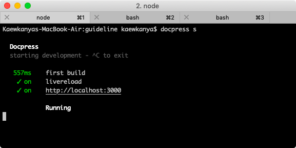
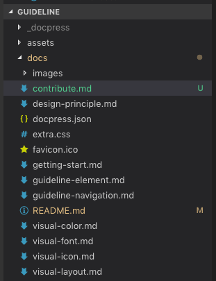

Contribute
==========

we use docspress to start project and use travis to automate deployment

## Clone project

Project are here > https://github.com/sankomdesign/guideline
please fork and clone to your environment or ask some [contibutor](https://github.com/sankomdesign/guideline/graphs/contributors) to add you to team

## ติดตั้ง node.js และ docpress

For mac, I recommend homebrew [Instruction](https://blog.teamtreehouse.com/install-node-js-npm-mac)

```sh
$ brew install node
```

For Windowns please read guideline from [nodejs.org](https://nodejs.org/en/download/package-manager/#windows)

ติดตั้ง library [docpress](https://github.com/docpress/docpress) โดยใช้คำสั่ง

```sh
$ npm install -g docpress
```

## เปิด web server บนเครื่อง

เข้าไปยัง folder ที่โครงการอยู่

```sh
$ cd guideline
$ docpress serve
```

ตัวเว็บจะเปิดขึ้นที่ Port 3000 > [http://localhost:3000](http://localhost:3000)



## edit document

เอกสารทั้งหมดจะอยู่ใน folder ชื่อ docs ในนั้นจะแยกเอกสารหนึ่งหน้าต่อหนึ่งไฟล์ เขียนด้วย [Markdown](https://github.com/adam-p/markdown-here/wiki/Markdown-Cheatsheet) แต่ละหน้าจะถูกเชื่อมโยงกันด้วยไฟล์ [docs/README.md](https://github.com/sankomdesign/guideline/blob/master/docs/README.md) 



## deploy your document

การติดตั้งลง server ให้ push ขึ้นไปที่ branch master หรือใช้ Pull Request ก็ได้ เมื่อ code ได้รับการยอมรับใส่ลงใน branch master แล้ว บริการ travis จะทำการ compile code แล้วใส่ไว้ที่ [branch gh-pages](https://github.com/sankomdesign/guideline/tree/gh-pages) โดยอัตโนมัติ ซึ่ง github จะเปิดให้เข้าได้ที่ [https://sankomdesign.github.io/guideline](https://sankomdesign.github.io/guideline)