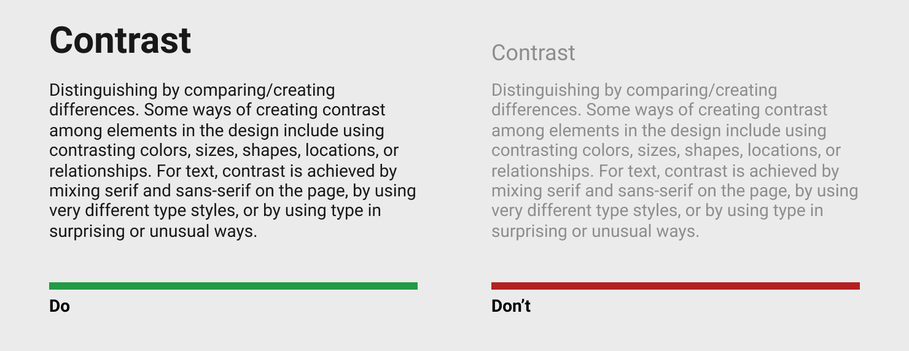

Design Principle
================

แสนคมนำหลักการของ [Design Principles](https://en.wikibooks.org/wiki/Graphic_Design/Principles_of_Design) ที่เป็นพื้นฐานของสมองในการทำความเข้าใจสิ่งต่าง ๆ มาใช้ในการออกแบบ UI เพื่อให้ผู้ใช้สามารถแยกแยะและจัดกลุ่มส่วนประกอบต่าง ๆ ของโปรแกรมออกได้โดยใช้ความคิดน้อยที่สุด ทั้งนี้แนวคิดที่เรานำมาใช้จะมีสี่ข้อหลักดังนี้ Contrast, Repetition, Alignment และ Proximity 

## Contrast

สมองของเราจะแยกของที่ดูต่างจากของชิ้นอื่น ๆ ออกมาโดยอัตโนมัติ ไม่ว่าจะเป็นสีที่ต่าง ขนาดที่ต่าง หรือรูปทรงที่ต่าง เราจึงอาศัยคุณสมบัตินี้มาออกแบบ UI เช่นการทำให้ ตัวอักษรอ่านง่ายขึ้น

สีของตัวหนังสือ (Foreground color) ทางซ้ายมือมีความเข้มต่างจากสีพื้นหลัง (Background color) อย่างชัดเจน ช่วยให้อ่านข้อความได้ง่าย ต่างจากทางขวามือที่สีตัวหนังสือและพื้นหลังคล้ายกันทำให้อ่านยาก โดยเฉพาะกับหน้าจอที่มีความคมชัดต่ำ หรือกับกลุ่มผู้ใช้ที่มีปัญหาทางสายตา นอกจากนี้ขนาดและความหนาของหัวข้อทางซ้ายมือยังชัดเจนช่วยให้ผู้ใช้รู้ได้ทันทีว่าเป็นหัวข้อ ต่างจากทางขวามือที่ต้องตั้งใจดูจึงจะรู้ว่าเป็นหัวข้อ 

## Repetition

asdf

## Alignment

asdf

## Proximity 

asdf