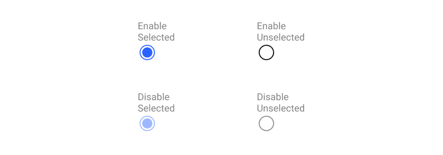

Element
==========

Element. คือส่วนที่ประกอบขึ้นเป็น User interface ผู้ใช้งานมีความคุ้นเคยกับ User interface จากประสบการณ์ที่ผ่านมาของพวกเขา โปรดเลือกใช้งานด้วยความระมัดระวัง โดยคำนึงถึงความสม่ำเสมอและสามารถคาดเดาได้ เพื่อช่วยให้เป้าหมายของผู้ใช้งานนั้นเสร็จแบบมีประสิทธิภาพและได้รับความพึงพอใจ

##### 1. Input controls
- Button, Data field, Toggles, List-Box, Dropdown list, Radio-button, Checkbox
  
##### 2. Navigational components
- Breadcrumb, Slider, Search, Pagination, tag

##### 3. Informational components
- Tool-tip, icon, Progress bar, Notification, Message Box, Modal

##### 4. Container
- Accordion

## Atomic design concept
...

## Button

#### Radio Button
- เลือกเพียงหนึ่งอย่างจากสิ่งที่มีทั้งหมด
- เห็นตัวเลือกทั้งหมดพร้อมๆกัน
#### State

