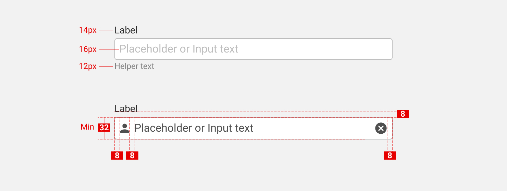
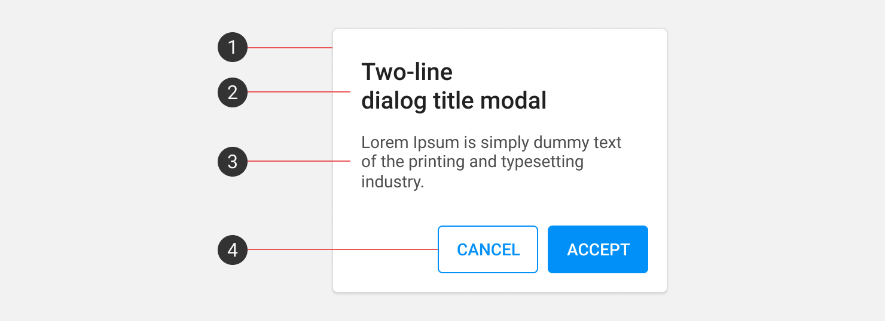
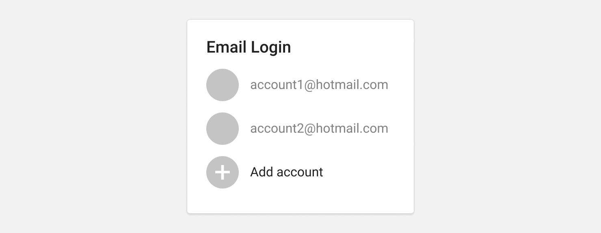
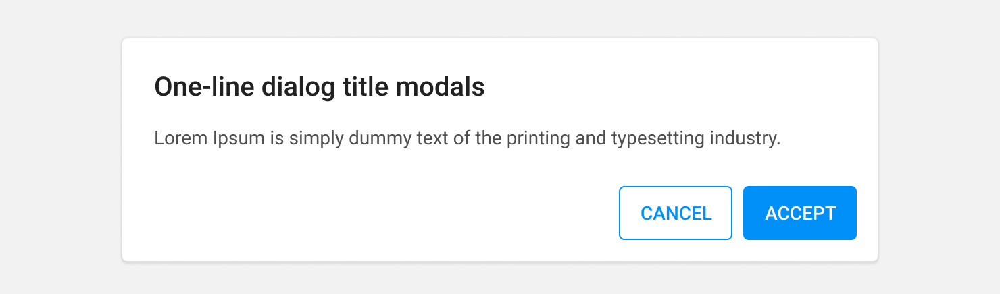
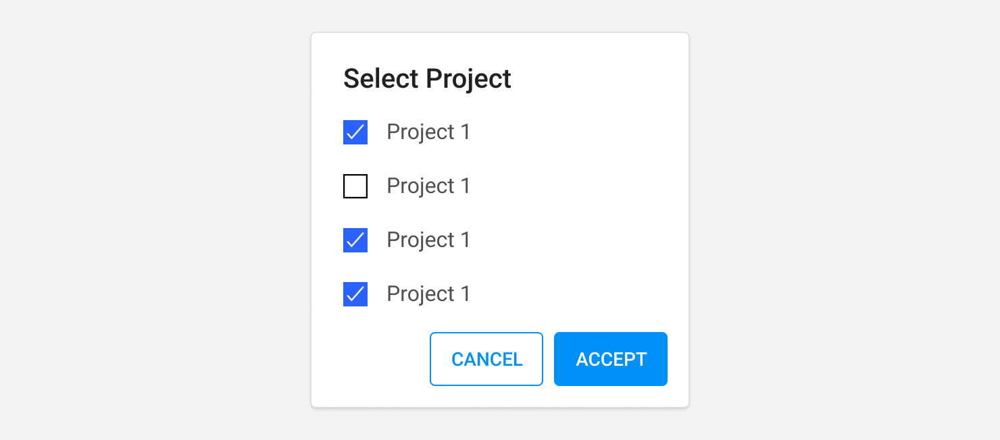
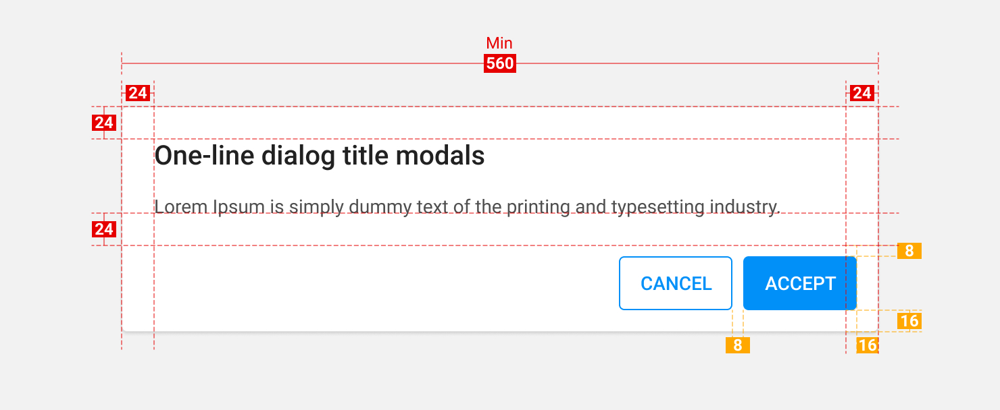
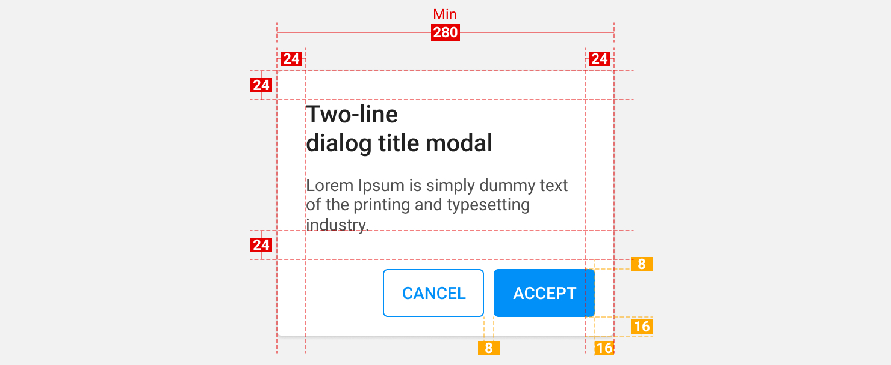

Element
==========

Element. คือส่วนที่ประกอบขึ้นเป็น User interface ผู้ใช้งานมีความคุ้นเคยกับ User interface จากประสบการณ์ที่ผ่านมาของพวกเขา โปรดเลือกใช้งานด้วยความระมัดระวัง โดยคำนึงถึงความสม่ำเสมอและสามารถคาดเดาได้ เพื่อช่วยให้เป้าหมายของผู้ใช้งานนั้นเสร็จแบบมีประสิทธิภาพและได้รับความพึงพอใจ

##### 1. Input controls
- Button, Data field, List-Box

##### 2. Selection controls
- Toggles, Radio-button, Checkbox, Dropdown list
  
##### 3. Navigational components
- Breadcrumb, Slider, Search, Pagination, Tag, Navigation Bar

##### 4. Informational components
- Tool-tip, icon, Progress bar, Notification, Message Box, Modal

##### 5. Container
- Accordion

## Input Box
ใช้สำหรับรับข้อมูลจากผู้ใช้งาน เพื่อนำข้อมูลไปเก็บหรือประมวลผลต่อ ใช้สำหรับรับข้อมูลเป็น Text หรือ ตัวเลข

#### Anatomy

1. Label
2. Leading Icon (optional)
3. Helper Text (optional)
4. Tailing Icon (optional)
5. Container 

#### State

#### Speces

#### Required text indicator
ถ้าส่วนใหญ่จำเป็นต้องกรอก ให้ระบุช่องกรอกเป็น (Optional) แทน แล้วเอา * ออกทั้งหมด

## Button

### ใช้ปุ่มอย่างไร ให้ผู้ใช้งานทำงานได้อย่างถูกต้อง
ก่อนอื่นให้แบ่งปุ่มออกเป็น 3 ประเภท คือ

1. Positive Button - มีการเปลี่ยนแปลง,ส่ง,เพิ่มข้อมูล เป็นต้น
2. Netural Button - ไม่มีการเปลี่ยนแปลง,กลับสู่หน้าที่ผู้ใช้งานเข้ามา เป็นต้น
3. Negative Button - ลบข้อมูล,รีเซ็ต เป็นต้น

เมื่อเราเข้าใจปุ่มแต่ละประเภทแล้ว ให้เราดูตามรูปแบบ Flow ของโปรแกรมดังนี้

#### Positive Flow
การทำงานของ Flow นี้จะเน้นไปในทางแก้ไขข้อมูล เพิ่มเติมข้อมูล ทำให้เราต้องเพิ่ม Contrast ให้กับปุ่ม นอกจากนั้นให้เลือกใช้สีที่ดูแล้วเห็นว่าปุ่มนี้เป็น Positive แน่นอน

#### Negative Flow
การทำงานของ Flow นี้จะเน้นไปในทางลบ,ทำลายข้อมูล ล้างข้อมูล ทำให้เราต้องเพิ่ม Contrast ให้กับปุ่ม นอกจากนั้นให้เลือกใช้สีที่ดูแล้วเห็นว่าปุ่มนี้เป็น Negative แน่นอน

#### Why Cancel Button should have lowest contrast
เนื่องจากปุ่ม Cancel ไม่ใช่ปุ่มที่ไว้สำหรับทำ Action เป็นเพียงปุ่มที่นำผู้ใช้งานกลับไปยังหน้าจอที่เขาเข้ามา การลด Contrast ให้ได้มากที่สุด จะทำให้ผู้ใช้งานรู้สึกปลอดภัยในการกดมากขึ้น แต่ไม่ควรใช้ Contrast ต่ำมากจนเหมือนปุ่มนั้นถูก Disable อยู่

#### 3 Button 1 Modal
ในกรณีที่มีทางเลือกให้กับผู้ใช้มากกว่า 2 อย่างขึ้นไป ให้ดูบริบทตาม Flow ของโปรแกรมเช่นเดียวกัน โดยเมื่อเกิดปุ่มมากกว่า 2 อย่าง ทำให้เราต้องตัดสินใจว่าจุดประสงค์ของโปรแกรมนั้นต้องการให้ผู้ใช้ทำอะไรเป็นหลัก ปุ่มนั้นจะเป็นปุ่มที่มี Contrast หนักที่สุด ปุ่มที่เหลือจะต้องลด Contrast ลงมา

## Selection Control

#### Checkbox

- เมื่อต้องการเลือกหนึ่งหรือหลายๆสิ่งจากหลายการ
- เมื่อมีตัวเลือกย่อยในหัวเรื่อง
- เมื่อต้องการเปิด-ปิดตัวเลือก (Desktop)

#### Radio

- เลือกเพียงหนึ่งอย่างจากสิ่งที่มีทั้งหมด
- เห็นตัวเลือกทั้งหมดพร้อมๆกัน

#### Switch
- เมื่อต้องการเปิด-ปิดสิ่งใดๆ (Tablet, Mobile)
- เมื่อต้องการเปิด-ปิดสิ่งใดๆ ซึ่งมีผลทันที

#### State

#### Speces

## Modals
เป็นสิ่งที่ไว้สำหรับแจ้งข้อมูลบางอย่างที่มีความสำคัญมากแก่ผู้ใช้งาน เพื่อให้ผู้ใช้งานตัดสินใจบางอย่าง

#### Anatomy

1. Container
2. Title (Optional)
3. Supporting Text
4. Buttons

#### Simple Modal
เป็น Modal อย่างง่าย ใช้เพื่อเสนอ Content บางอย่างที่มีความสำคัญแก่ผู้ใช้งาน อาจจะเป็นตัวเลือกที่เมื่อผู้ใช้งานเลือกแล้วมีผลทันที

#### Alert Modal
เป็น Modal สำหรับแจ้งเตือนผู้ใช้งานให้ทำการตัดสินใจ จึงจะสามารถทำรายการต่อไปได้

#### Confirmation Modal
เป็น Modal สำหรับให้ผู้ใช้งานตัดสินใจเลือกบางอย่าง จากสิ่งที่ Modal แสดงผลออกมา

 
#### Speces
 
 Modal Desktop

 Modal Mobile
 

## List of items
การแสดงรายการต่างๆเช่น รายการเอกสาร, รายการของผู้ใช้งาน นอกจากการแสดงผลแบบตารางแล้ว ยังสามารถแสดงรายการด้วยการ์ดได้ โดยปรับหัวตารางให้ไปอยู่คู่กับชุดข้อมูล และกลุ่มของข้อมูลที่มีความสัมพันธ์กันก็สามารถอยู่ด้วยกันโดยอาศัยหัวตาราง (label) เดียวกัน

