Element
==========

Element. คือส่วนที่ประกอบขึ้นเป็น User interface ผู้ใช้งานมีความคุ้นเคยกับ User interface จากประสบการณ์ที่ผ่านมาของพวกเขา โปรดเลือกใช้งานด้วยความระมัดระวัง โดยคำนึงถึงความสม่ำเสมอและสามารถคาดเดาได้ เพื่อช่วยให้เป้าหมายของผู้ใช้งานนั้นเสร็จแบบมีประสิทธิภาพและได้รับความพึงพอใจ

##### 1. Input controls
- Button, Data field, List-Box

##### 2. Selection controls
- Toggles, Radio-button, Checkbox, Dropdown list
  
##### 3. Navigational components
- Breadcrumb, Slider, Search, Pagination, Tag, Navigation Bar

##### 4. Informational components
- Tool-tip, icon, Progress bar, Notification, Message Box, Modal

##### 5. Container
- Accordion

## Input Box
#### **ชัดเจน, แตกต่างและมีประสิทธ์ภาพ**
ช่องที่ไว้สำหรับกรอกข้อมูลต้องดูแตกต่างจากข้อความปกติ ต้องเชื้อเชิญให้มีปฏิสัมพันธ์
ระยะห่างระหว่างกันต้องเพียงพอต่อการแยกแยะว่ากำลังกรอกช่องใดอยู่ 
เมื่อใดที่กรอกผิดหรือเกิดความผิดพลาดใดๆ ตัวผู้ใช้งานเองสามารถแก้ปัญหาได้ด้วยตัวเองอย่างรวดเร็ว

#### รูปร่างหน้าตาของช่องกรอก
เพื่อให้มีประสิทธิภาพรูปร่างหน้าตาควรจะดูเป็นช่องว่างและมีปฏิสัมพันธ์ได้

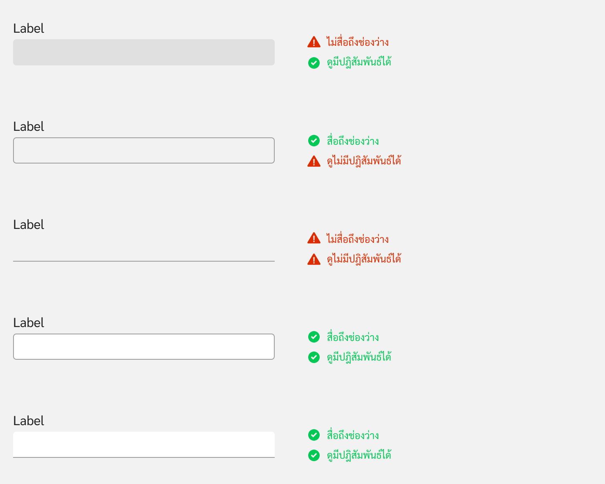

#### ระยะห่างระหว่างกัน
ต้องเพียงพอให้แยกได้ว่า **ป้ายชื่อ (Label)** นั้นๆเป็นของช่องกรอกใด

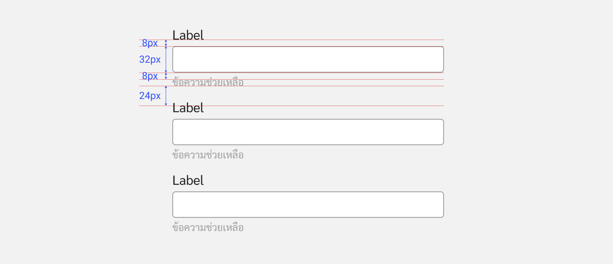

#### การเรียงลำดับของช่องกรอก
หากเป็นไปได้ 1 บรรทัดควรมีช่องกรอง 1 ช่อง หากมีมากกว่านั้นจะทำให้ประสิทธิภาพหายไปเนื่องจากผู้ใช้งานต้องตีความความสัมพันธ์ของแต่ละช่องกรอก
ว่าควรกรอกแนวตั้งหรือแนวนอนก่อน

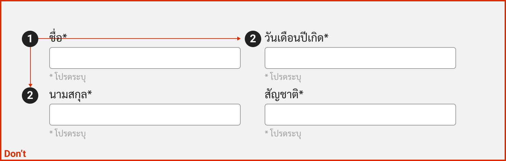
ผู้ใช้งานต้องตีความว่าควรจะกรอกแนวตั้งหรือแนวนอนก่อน แล้วจะกรอกยากขึ้นอีกเมื่อมีจำนวน Row-Column เพิ่มมากขึ้น 

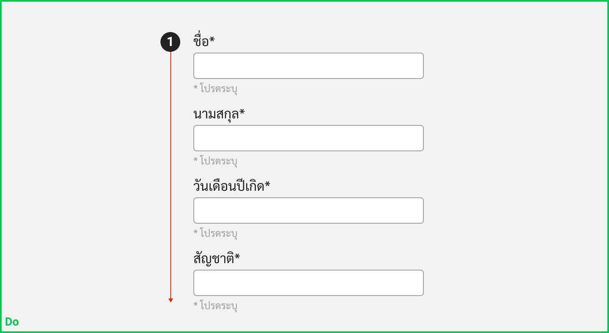
กรอกบน-ลงล่างทิศทางเดียว

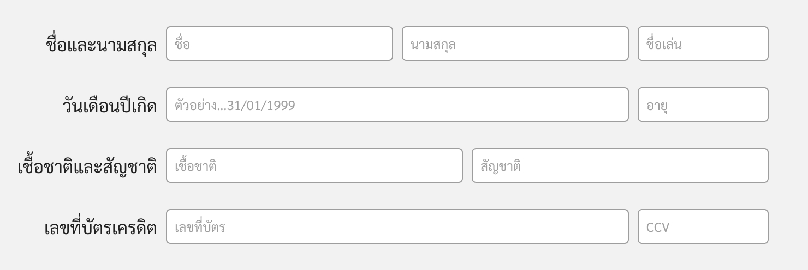
ด้วยปริมาณข้อมูลที่มีมากเมื่อใช้งานจริง หากมีเนื่อที่จำกัด ให้จัดกลุ่มข้อมูลพร้อมที่ตั้งชื่อกลุ่มให้มีความสัมพันธ์กัน เรายังใช้ประโยชน์ของ 1 ช่องกรอกต่อ 1 แถว
เพียงแค่ตีความว่าใน 1 ช่องกรอกมีอีกหลายเรื่องย่อย

#### โครงสร้าง
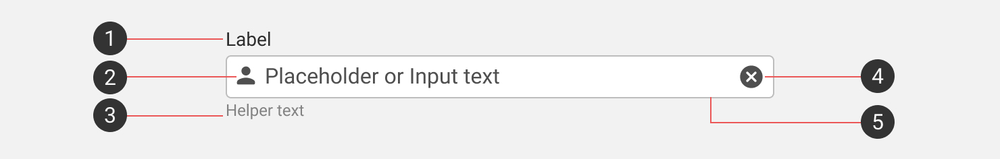

1. **ชื่อ** / Label 
2. **ไอคอนหน้า*** / Leading Icon 
3. **ข้อความช่วยเหลือ** / Helper Text 
4. **ไอคอนหลัง*** / Tailing Icon
5. **ช่องกรอก** / Text field
   
*ไม่จำเป็นต้องมี
   
#### สถานะต่างๆ
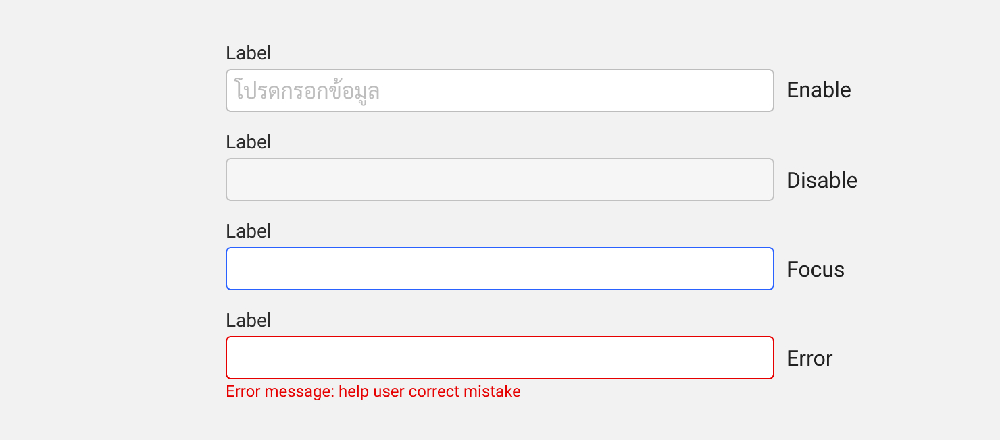

#### ช่องที่จำเป็นต้องกรอก
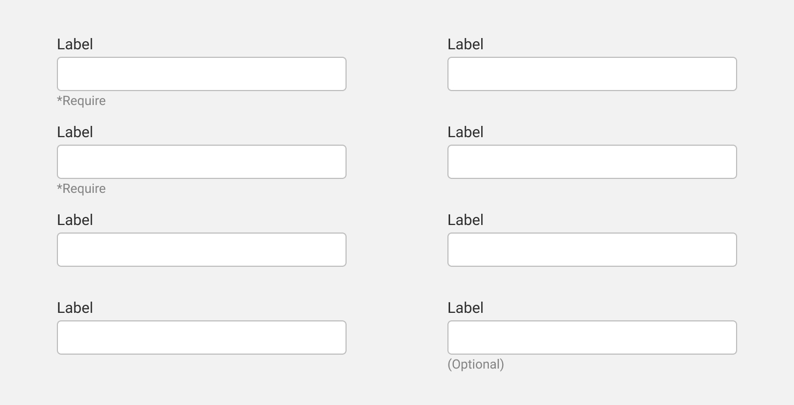
ถ้าส่วนใหญ่จำเป็นต้องกรอก ให้ระบุช่องกรอกเป็น (Optional) แทน แล้วเอา * ออกทั้งหมด

## Selection Control

การใช้งาน Selection Control แต่ละชนิดนั้น มีวัตถุประสงค์ในการใช้ไม่เหมือนกันดังนี้

#### เมื่อความชัดเจนและความรวดเร็วเป็นสิ่งสำคัญที่สุด

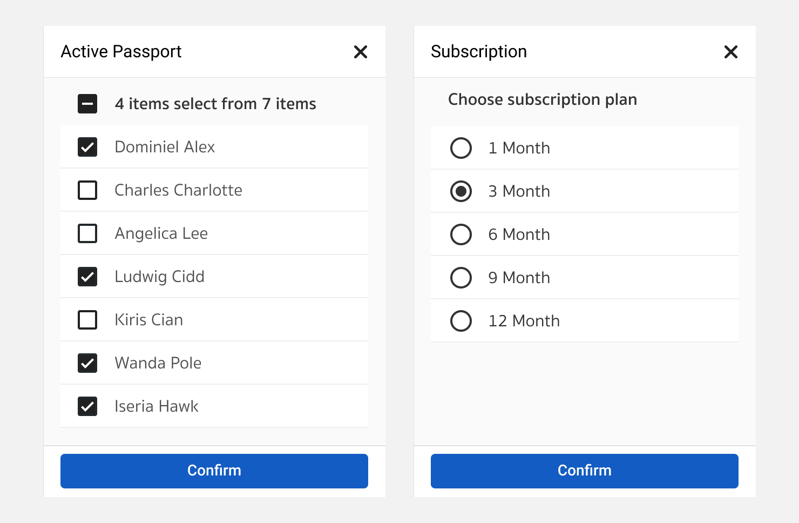
เมื่อ Requirement ต้องการใช้ผู้ใช้งาน ใช้ระบบได้อย่างรวดเร็ว การใช้งาน Checkbox, Radio และ Switch จะเป็นสิ่งที่ตอบโจทย์นี้ที่สุด เพราะการใช้ Dropdown จะเป็นการเพิ่มงานให้กับผู้ใช้งานเพราะต้องคลิ๊กเข้าไปดูว่ามีรายการอะไรให้เลือกบ้าง

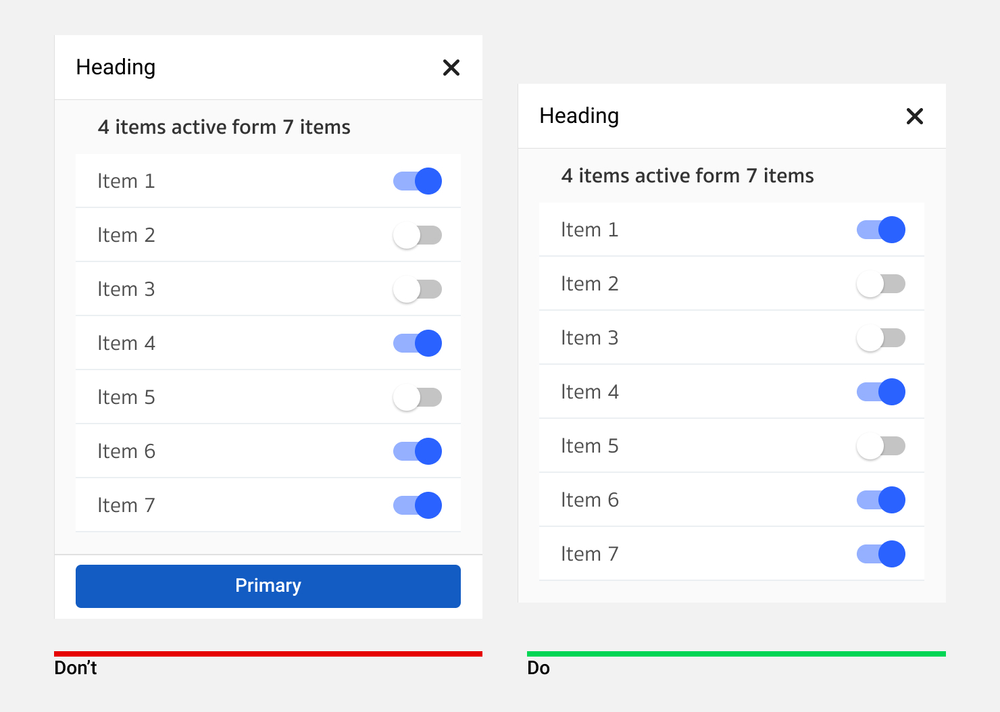
ไม่ใช้ปุ่มร่วมกันกับ Switch เนื่องจากการทำงานของ Switch นั้นมีผลทันทีโดยที่ไม่ต้องกดปุ่มยืนยัน

#### เมื่ออยู่ในพื้นที่ที่มีจำกัด

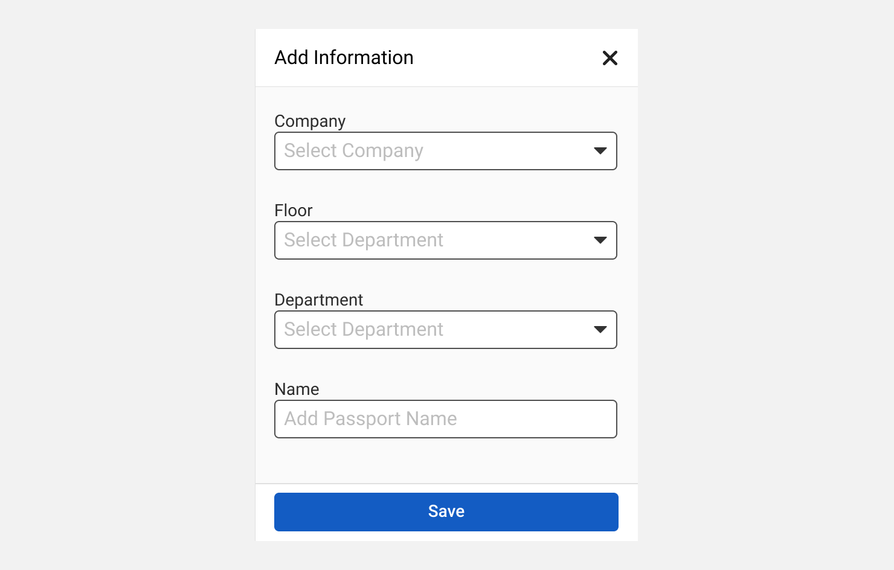
เมื่อมีพื้นที่ใช้งานอย่างจำกัด และมีสิ่งที่ต้องการให้ผู้ใช้งานเลือกจำนวนมาก การใช้งาน Dropdown จะทำให้ประหยัดพื้นที่ได้มาก

#### Searchable Dropdown

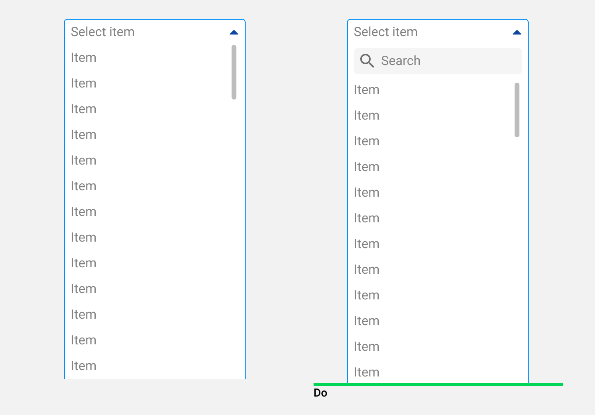
กรณีที่ใน Dropdown มีตัวเลือกจำนวนมาก จะทำให้ผู้ใช้เวลาในการหาสิ่งที่เขาต้องการยากมากๆ แก้ปัญหาโดยการใช้ Searchable Dropdown 

## Button
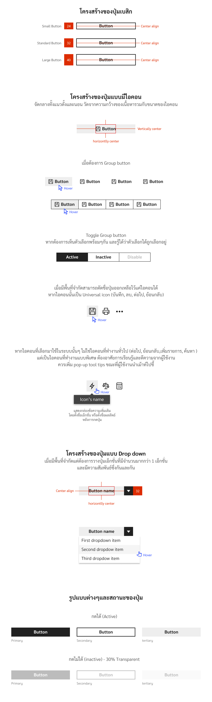

### ใช้ปุ่มอย่างไร ให้ผู้ใช้งานทำงานได้อย่างถูกต้อง
ก่อนอื่นให้แบ่งปุ่มออกเป็น 3 ประเภท คือ

1. Positive Button - มีการเปลี่ยนแปลง,ส่ง,เพิ่มข้อมูล เป็นต้น
2. Netural Button - ไม่มีการเปลี่ยนแปลง,กลับสู่หน้าที่ผู้ใช้งานเข้ามา เป็นต้น
3. Negative Button - ลบข้อมูล,รีเซ็ต เป็นต้น

เมื่อเราเข้าใจปุ่มแต่ละประเภทแล้ว ให้เราดูตามรูปแบบ Flow ของโปรแกรมดังนี้

### Positive Flow
การทำงานของ Flow นี้จะเน้นไปในทางแก้ไขข้อมูล เพิ่มเติมข้อมูล ทำให้เราต้องเพิ่ม Contrast ให้กับปุ่ม นอกจากนั้นให้เลือกใช้สีที่ดูแล้วเห็นว่าปุ่มนี้เป็น Positive

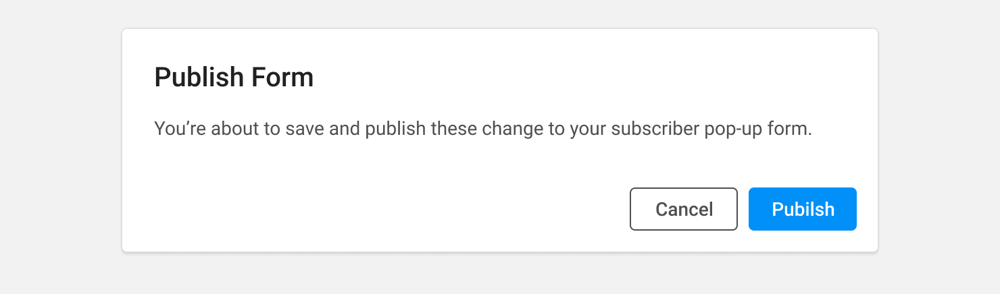

### Negative Flow
การทำงานของ Flow นี้จะเน้นไปในทางลบ,ทำลายข้อมูล ล้างข้อมูล ทำให้เราต้องเพิ่ม Contrast ให้กับปุ่ม นอกจากนั้นให้เลือกใช้สีที่ดูแล้วเห็นว่าปุ่มนี้เป็น Negative

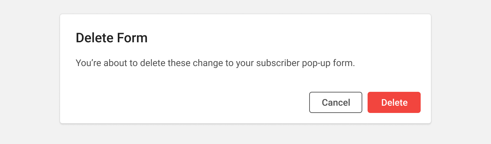

### Why Cancel Button should have lowest contrast
เนื่องจากปุ่ม Cancel ไม่ใช่ปุ่มที่ไว้สำหรับทำ Action เป็นเพียงปุ่มที่นำผู้ใช้งานกลับไปยังหน้าจอที่เขาเข้ามา การลด Contrast ให้ได้มากที่สุด จะทำให้ผู้ใช้งานรู้สึกปลอดภัยในการกดมากขึ้น แต่ไม่ควรใช้ Contrast ต่ำมากจนเหมือนปุ่มนั้นถูก Disable อยู่

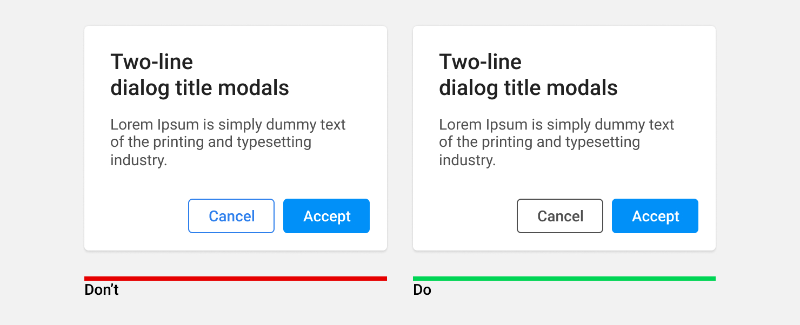

### More than 2 button
ในกรณีที่มีทางเลือกให้กับผู้ใช้ทำงานกับระบบมากกว่า 2 อย่างขึ้นไปทำให้เราต้องตัดสินใจว่าจุดประสงค์ของโปรแกรมนั้นต้องการให้ผู้ใช้ทำอะไรเป็นหลัก ปุ่มนั้นจะเป็นปุ่มที่มี Contrast หนักที่สุด ปุ่มที่เหลือจะต้องลด Contrast ลงมา
และจะมีปุ่ม "กากบาท" เกิดขึ้นมาแทนปุ่ม Cancel 

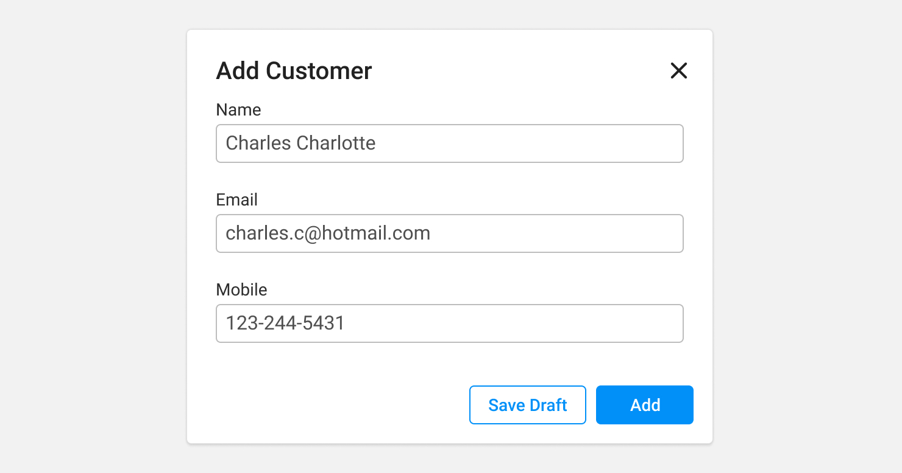

## Modal
ใช้เพื่อเป็นตัวคั่นจังหวะ เพื่อให้ผู้ใช้งานได้ทำการทบทวนอีกรอบก่อนจะยืนยัน หรือเพื่อให้ข้อมูลกับผู้ใช้งาน

1. Confirmation Modal - ใช้เพื่อยืนยันการกระทำบางอย่างของผู้ใช้งาน เช่นต้องการเพิ่มข้อมูล ต้องการยืนยันที่จะลบข้อมูล เป็นต้น
2. Information Modal - ใช้เพื่อเพียงให้ข้อมูล หรือ Response จากระบบ เช่น Response บอกผู้ใช้ว่าทำการบันทึกเรียบร้อย เป็นต้น

### Anatomy
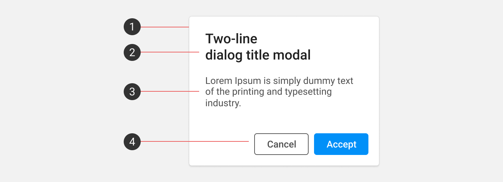
1. Container
2. Title
3. Supporting Text
4. Buttons

### Priority of Modal
การใช้งาน Modal แบ่งการใช้งานตามความ Priority คือ
| Priority    | Component            | User Action         |
| ----------- | -------------------- | ------------------- |
| High        | Confirmation Modal   | กดปุ่มตัดสินใจที่จะเลือกทำ หรือ กระทำบางอย่างกับระบบเพื่อให้งานเสร็จสมบูรณ์|
| Low         | Information Modal    | กดปุ่มเพื่อรับทราบ หรือ หายไปอัตโนมัติเมื่อหมดเวลา |

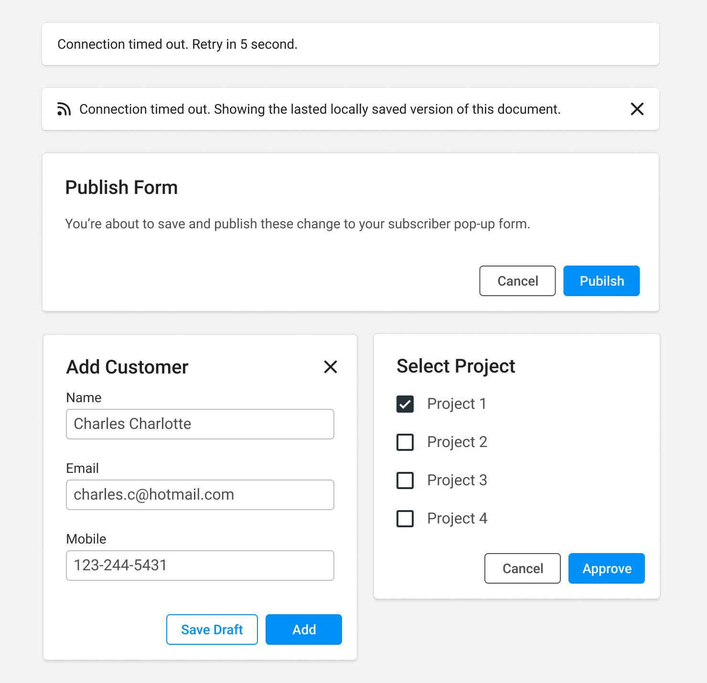

### Make sense your Modal

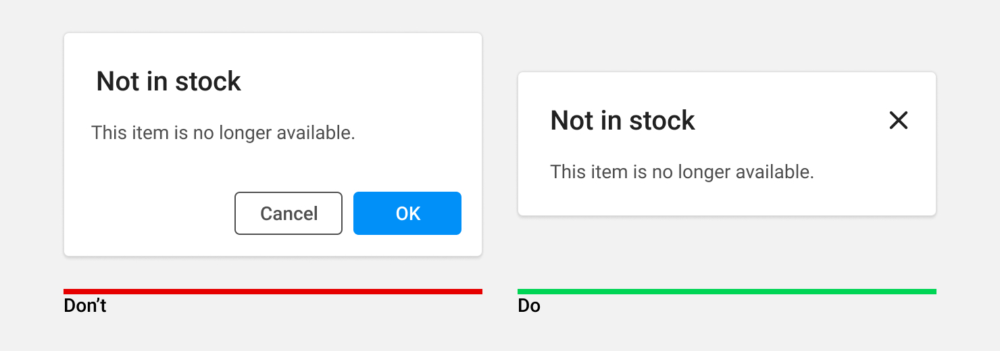
ระวังการใช้งานปุ่มดังตัวอย่างในรูป เนื่องจากทั้งปุ่ม OK และ ปุ่ม Cancel ให้ Response เหมือนกันคือกล่อง Modal หายไป ถึงแม้จะลดเหลือปุ่มเดียวก็พอจะดู Make sense แต่ก็ไม่ใช่ปุ่มที่ไว้ทำ Action อยู่ดี แก้ปัญหาโดยการใช้ปุ่ม "กากบาท" แทน

## List of items
การแสดงรายการต่างๆเช่น รายการเอกสาร, รายการของผู้ใช้งาน นอกจากการแสดงผลแบบตารางแล้ว ยังสามารถแสดงรายการด้วยการ์ดได้ โดยปรับหัวตารางให้ไปอยู่คู่กับชุดข้อมูล และกลุ่มของข้อมูลที่มีความสัมพันธ์กันก็สามารถอยู่ด้วยกันโดยอาศัยหัวตาราง (label) เดียวกัน

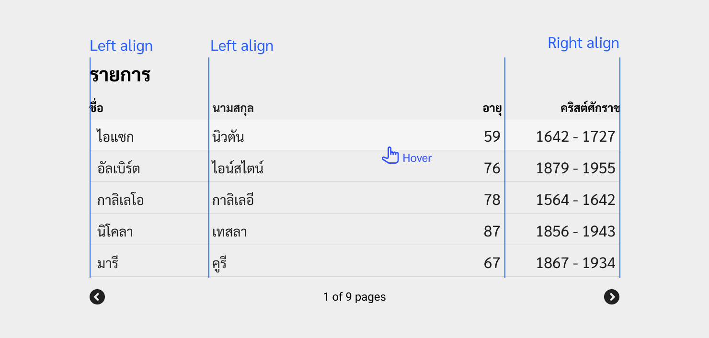
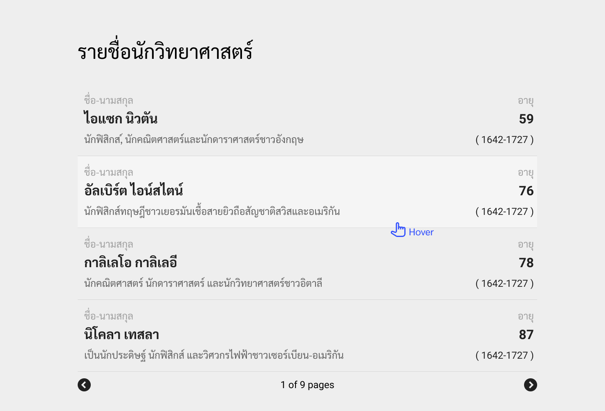
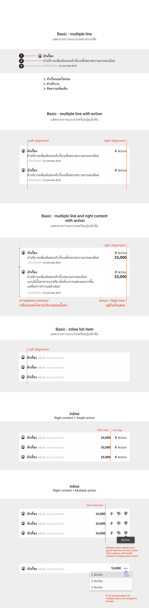

## Card
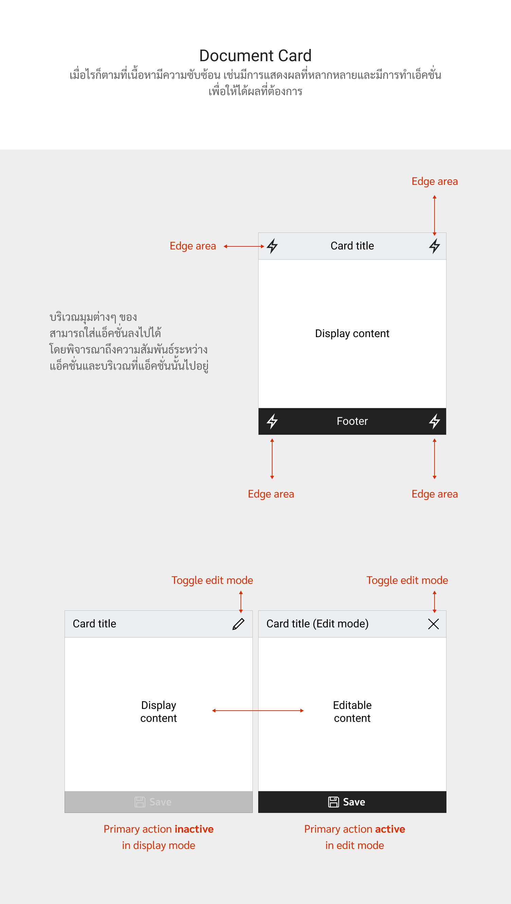