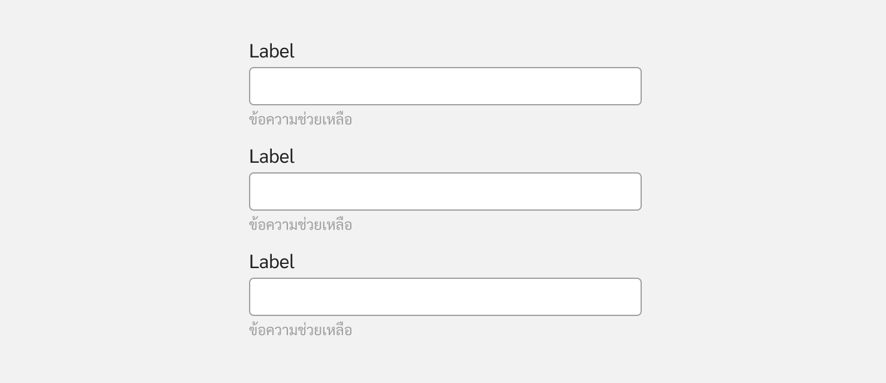
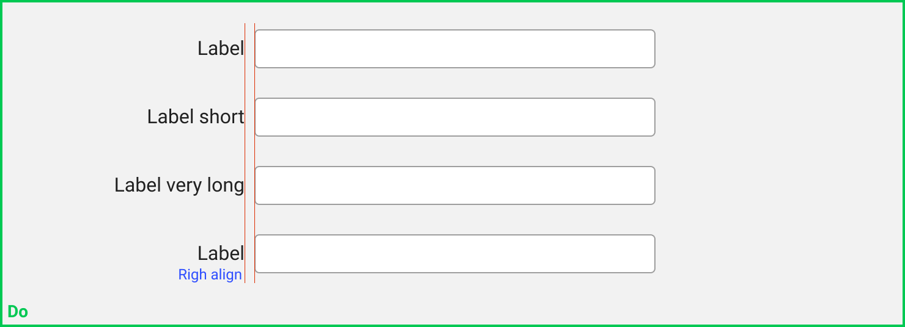
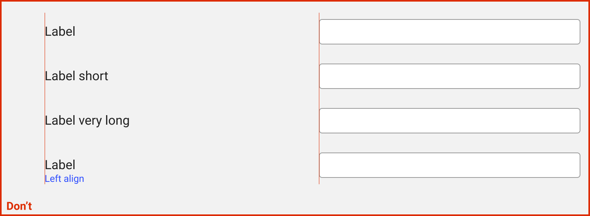
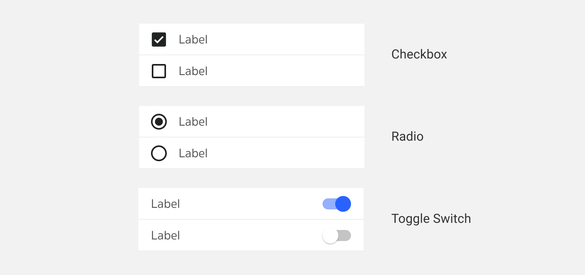
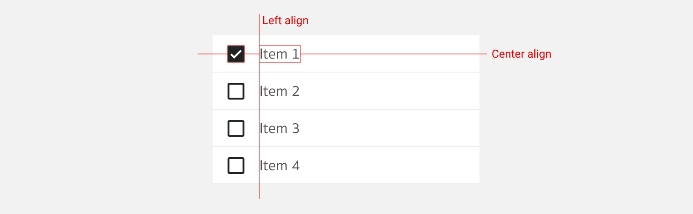
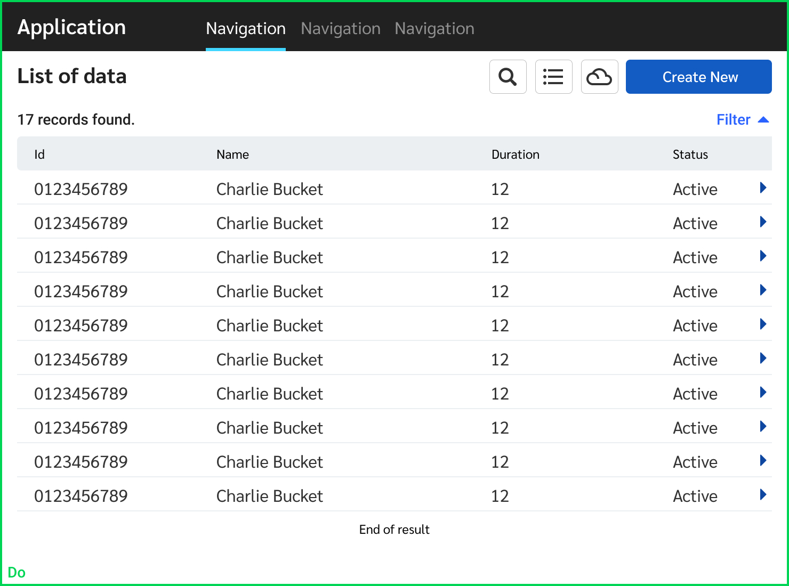
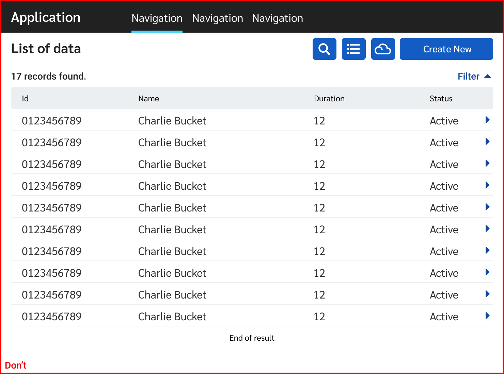
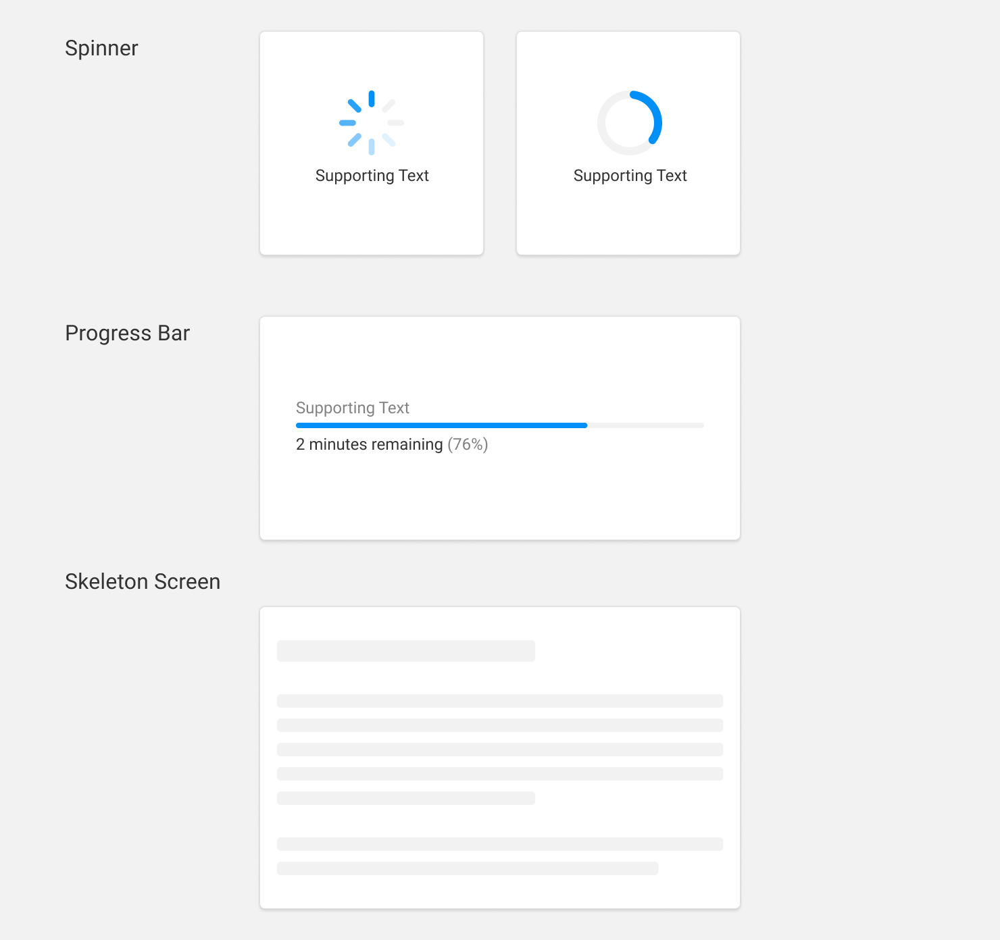

Element
==========

Element. คือส่วนที่ประกอบขึ้นเป็น User interface ผู้ใช้งานมีความคุ้นเคยกับ User interface จากประสบการณ์ที่ผ่านมาของพวกเขา โปรดเลือกใช้งานด้วยความระมัดระวัง โดยคำนึงถึงความสม่ำเสมอและสามารถคาดเดาได้ เพื่อช่วยให้เป้าหมายของผู้ใช้งานนั้นเสร็จแบบมีประสิทธิภาพและได้รับความพึงพอใจ

##### 1. Input controls
- Button, Data field, List-Box

##### 2. Selection controls
- Toggles, Radio-button, Checkbox, Dropdown list
  
##### 3. Navigational components
- Breadcrumb, Slider, Search, Pagination, Tag, Navigation Bar

##### 4. Informational components
- Tool-tip, icon, Progress bar, Notification, Message Box, Modal

##### 5. Container
- Accordion

## Input Box
#### **ชัดเจน, แตกต่างและมีประสิทธ์ภาพ**
ช่องที่ไว้สำหรับกรอกข้อมูลต้องดูแตกต่างจากข้อความปกติ ต้องเชื้อเชิญให้มีปฏิสัมพันธ์
ระยะห่างระหว่างกันต้องเพียงพอต่อการแยกแยะว่ากำลังกรอกช่องใดอยู่ 
เมื่อใดที่กรอกผิดหรือเกิดความผิดพลาดใดๆ ตัวผู้ใช้งานเองสามารถแก้ปัญหาได้ด้วยตัวเองอย่างรวดเร็ว

#### รูปร่างหน้าตาของช่องกรอก
เพื่อให้มีประสิทธิภาพรูปร่างหน้าตาควรจะดูเป็นช่องว่างและมีปฏิสัมพันธ์ได้

#### ระยะห่างระหว่างกัน
ต้องเพียงพอให้แยกได้ว่า **ป้ายชื่อ (Label)** นั้นๆเป็นของช่องกรอกใด

#### การเรียงลำดับของช่องกรอก
หากเป็นไปได้ 1 บรรทัดควรมีช่องกรอง 1 ช่อง หากมีมากกว่านั้นจะทำให้ประสิทธิภาพหายไปเนื่องจากผู้ใช้งานต้องตีความความสัมพันธ์ของแต่ละช่องกรอก
ว่าควรกรอกแนวตั้งหรือแนวนอนก่อน

ผู้ใช้งานต้องตีความว่าควรจะกรอกแนวตั้งหรือแนวนอนก่อน แล้วจะกรอกยากขึ้นอีกเมื่อมีจำนวน Row-Column เพิ่มมากขึ้น 

กรอกบน-ลงล่างทิศทางเดียว

ด้วยปริมาณข้อมูลที่มีมากเมื่อใช้งานจริง หากมีเนื่อที่จำกัด ให้จัดกลุ่มข้อมูลพร้อมที่ตั้งชื่อกลุ่มให้มีความสัมพันธ์กัน เรายังใช้ประโยชน์ของ 1 ช่องกรอกต่อ 1 แถว
เพียงแค่ตีความว่าใน 1 ช่องกรอกมีอีกหลายเรื่องย่อย

#### รูปแบบการว่างป้ายชื่อของช่องกรอก
เลือกใช้ได้ตามความเหมาะสม โดยให้คำนึงถึงประสิทธิภาพ การตีความของความสัมพันธ์ของแต่ละช่องกรอกและการใช้พื้นที่หน้าจอ

##### แบบมาตรฐาน / Standard text-field

##### แบบป้ายชื่ออยู่ระนาบเดียวกันช่องกรอก / Inline label text-field

ป้ายชื่อ - ช่องกรอกต้องอยู่ใกล้กันให้มากที่สุด หากห่างกันมากจะทำให้ประสิทธิภาพลดลง

#### โครงสร้าง

1. **ชื่อ** / Label 
2. **ไอคอนหน้า*** / Leading Icon 
3. **ข้อความช่วยเหลือ** / Helper Text 
4. **ไอคอนหลัง*** / Tailing Icon
5. **ช่องกรอก** / Text field
   
*ไม่จำเป็นต้องมี
   
#### สถานะต่างๆ

#### ช่องที่จำเป็นต้องกรอก

เมื่อใดก็ตามที่จำนวนของช่องกรอกที่ต้องระบุบมีมากกว่าช่องกรอกที่เว้นว่างได้ ให้นำ **Required indicator** ออกทั้งหมดและบอกผู้ใช้งานเพียงแค่ว่าช่องใหนให้ผู้ใช้งานข้ามได้

## Selection Control
#### ชนิดของ Selection Control

#### Label Alignment

การใช้งาน Selection Control แต่ละชนิดนั้น มีวัตถุประสงค์ในการใช้ไม่เหมือนกันดังนี้
#### เมื่อความชัดเจนและความรวดเร็วเป็นสิ่งสำคัญที่สุด

เมื่อ Requirement ต้องการใช้ผู้ใช้งาน ใช้ระบบได้อย่างรวดเร็ว การใช้งาน Checkbox, Radio และ Switch จะเป็นสิ่งที่ตอบโจทย์นี้ที่สุด เพราะการใช้ Dropdown จะเป็นการเพิ่มงานให้กับผู้ใช้งานเพราะต้องคลิ๊กเข้าไปดูว่ามีรายการอะไรให้เลือกบ้าง

ไม่ใช้ปุ่มร่วมกันกับ Switch เนื่องจากการทำงานของ Switch นั้นมีผลทันทีโดยที่ไม่ต้องกดปุ่มยืนยัน

#### เมื่ออยู่ในพื้นที่ที่มีจำกัด

เมื่อมีพื้นที่ใช้งานอย่างจำกัด และมีสิ่งที่ต้องการให้ผู้ใช้งานเลือกจำนวนมาก การใช้งาน Dropdown จะทำให้ประหยัดพื้นที่ได้มาก

#### Searchable Dropdown

กรณีที่ใน Dropdown มีตัวเลือกจำนวนมาก จะทำให้ผู้ใช้เวลาในการหาสิ่งที่เขาต้องการยากมากๆ แก้ปัญหาโดยการใช้ Searchable Dropdown 

## Button

### ใช้ปุ่มอย่างไร ให้ผู้ใช้งานทำงานได้อย่างถูกต้อง
ก่อนอื่นให้แบ่งปุ่มออกเป็น 3 ประเภท คือ

1. Positive Button - มีการเปลี่ยนแปลง,ส่ง,เพิ่มข้อมูล เป็นต้น
2. Netural Button - ไม่มีการเปลี่ยนแปลง,กลับสู่หน้าที่ผู้ใช้งานเข้ามา เป็นต้น
3. Negative Button - ลบข้อมูล,รีเซ็ต เป็นต้น

เมื่อเราเข้าใจปุ่มแต่ละประเภทแล้ว ให้เราดูตามรูปแบบ Flow ของโปรแกรมดังนี้

### Positive Flow
การทำงานของ Flow นี้จะเน้นไปในทางแก้ไขข้อมูล เพิ่มเติมข้อมูล ทำให้เราต้องเพิ่ม Contrast ให้กับปุ่ม นอกจากนั้นให้เลือกใช้สีที่ดูแล้วเห็นว่าปุ่มนี้เป็น Positive

### Negative Flow
การทำงานของ Flow นี้จะเน้นไปในทางลบ,ทำลายข้อมูล ล้างข้อมูล ทำให้เราต้องเพิ่ม Contrast ให้กับปุ่ม นอกจากนั้นให้เลือกใช้สีที่ดูแล้วเห็นว่าปุ่มนี้เป็น Negative

### Why low contrast button should be applied
ในกรณีที่หน้าจอ User Interface มีหลากหลายปุ่มมากขึ้น คงไม่ดีแน่ๆถ้ามีปุ่ม Primary แข่งกันเด่นบนหน้าจอ จึงจำเป็นต้องมาทบทวนว่า Main หลักของระบบนั้นๆเอาไว้ใช้ทำอะไร ปุ่มนั้นๆที่เป็นปุ่มหลักจะมี Contrast หนักที่สุด และปุ่มที่เหลือจะลด Contrast ลงมา

## Modal
ใช้เพื่อเป็นตัวคั่นจังหวะ เพื่อให้ผู้ใช้งานได้ทำการทบทวนอีกรอบก่อนจะยืนยัน หรือเพื่อให้ข้อมูลกับผู้ใช้งาน

1.Overlay Modal

2.Full Screen Modal

### Basic Anatomy

1. Container
2. Title
3. Supporting Text
4. Buttons

### Priority of Modal
การใช้งาน Modal แบ่งการใช้งานตามความ Priority คือ
| Priority    | Component            | User Action         |
| ----------- | -------------------- | ------------------- |
| High        | Confirmation Modal   | กดปุ่มตัดสินใจที่จะเลือกทำ หรือ กระทำบางอย่างกับระบบเพื่อให้งานเสร็จสมบูรณ์|
| Low         | Information Modal    | กดปุ่มเพื่อรับทราบ หรือ หายไปอัตโนมัติเมื่อหมดเวลา |

## List of items
การแสดงรายการต่างๆเช่น รายการเอกสาร, รายการของผู้ใช้งาน นอกจากการแสดงผลแบบตารางแล้ว ยังสามารถแสดงรายการด้วยการ์ดได้ โดยปรับหัวตารางให้ไปอยู่คู่กับชุดข้อมูล และกลุ่มของข้อมูลที่มีความสัมพันธ์กันก็สามารถอยู่ด้วยกันโดยอาศัยหัวตาราง (label) เดียวกัน

## Card

## Loading Element
การใช้งานแอปพลิเคชันตามปกติแล้ว มนุษย์จะเริ่มรู้สึกว่าจะต้องรอเมื่อเวลาผ่านไปมากกว่า 1 วินาที การใช้งาน Loading Element เป็นสิ่งที่ไว้สำหรับบอกผู้ใช้งานว่าเขาจะต้องรอการทำงานของระบบจึงจะสามารถทำงานต่อไปได้

#### การเลือกใช้งาน
| Component       | Waiting Time   |
| --------------- | -------------- | 
| None            | < 1 seconds    | 
| Spinner         | 1-4 seconds    | 
| Skeleton Screen | 1-4 seconds    |
| Progress Bar    | > 4 seconds    |

