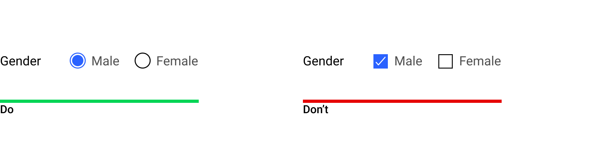

Element
==========

Element. คือส่วนที่ประกอบขึ้นเป็น User interface ผู้ใช้งานมีความคุ้นเคยกับ User interface จากประสบการณ์ที่ผ่านมาของพวกเขา โปรดเลือกใช้งานด้วยความระมัดระวัง โดยคำนึงถึงความสม่ำเสมอและสามารถคาดเดาได้ เพื่อช่วยให้เป้าหมายของผู้ใช้งานนั้นเสร็จแบบมีประสิทธิภาพและได้รับความพึงพอใจ

##### 1. Input controls
- Button, Data field, List-Box, Dropdown list

##### 2. Selection controls
- Toggles, Radio-button, Checkbox
  
##### 3. Navigational components
- Breadcrumb, Slider, Search, Pagination, tag

##### 4. Informational components
- Tool-tip, icon, Progress bar, Notification, Message Box, Modal

##### 5. Container
- Accordion

## Atomic design concept
...

## Button

### Text Label

เป็นคำพูดที่ใช้อธิบายการทำงานของปุ่มแบบสั้นๆ เพื่อให้เข้าใจและสามารถคาดเดาได้ว่าจะเกิดอะไรขึ้นเมื่อกดปุ่ม และใช้ตัวอักษรพิมพ์ใหญ่ ถ้าหากเป็นภาษาอังกฤษ เพื่อให้เห็นถึงความแตกต่าง

ควรใช้คำอธิบายภายในหนึ่งบรรทัด ไม่ควรทำเป็นสองบรรทัด

### Text Button

เป็นปุ่มที่มีความเด่นน้อยที่สุดในบรรดาปุ่มทั้งหมด ใช้งานเมื่ออยู่ร่วมกันกับ Cards หรือ Dialogs ต่างๆ

### Outline Button

เป็นปุ่มที่มีความเด่นปานกลาง ใช้งานเมื่อที่ใช้เพื่อให้เป็นตัวเลือกรองมาจากตัวเลือกหลัก เพื่อให้มีการตัดสินใจบางอย่าง

### Contained Button

เป็นปุ่มที่มีความเด่นมากที่สุดในบรรดาปุ่มทั้งหมด ใช้งานเพื่อเป็น Call to Action หลัก

### Toggle Button

เป็นปุ่มที่ใช้สำหรับเปิดหรือปิด Function ต่างๆ ซึ่งมีผลทันทีที่กดปุ่ม

## Selection Control

### Checkbox

- เมื่อต้องการเลือกหนึ่งหรือหลายๆสิ่งจากหลายการ
- เมื่อมีตัวเลือกย่อยในหัวเรื่อง
- เมื่อต้องการเปิด-ปิดตัวเลือก (Desktop)

### Radio

- เลือกเพียงหนึ่งอย่างจากสิ่งที่มีทั้งหมด
- เห็นตัวเลือกทั้งหมดพร้อมๆกัน

### Switch
- เมื่อต้องการเปิด-ปิดสิ่งใดๆ (Tablet, Mobile)
- เมื่อต้องการเปิด-ปิดสิ่งใดๆ ซึ่งมีผลทันที

### State

### Speces

