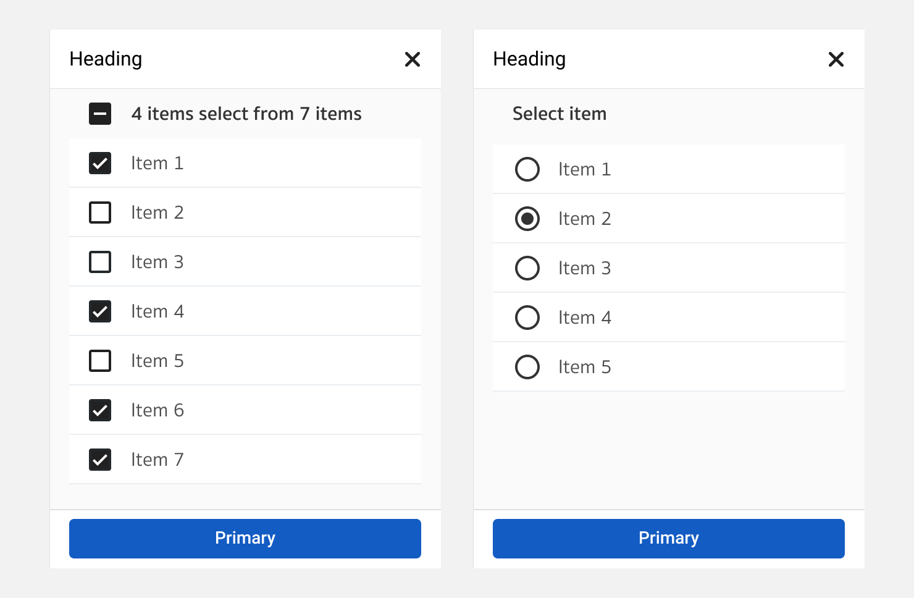
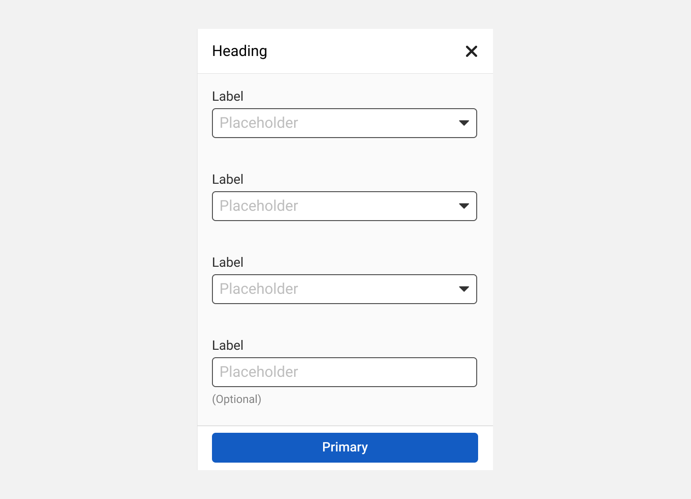
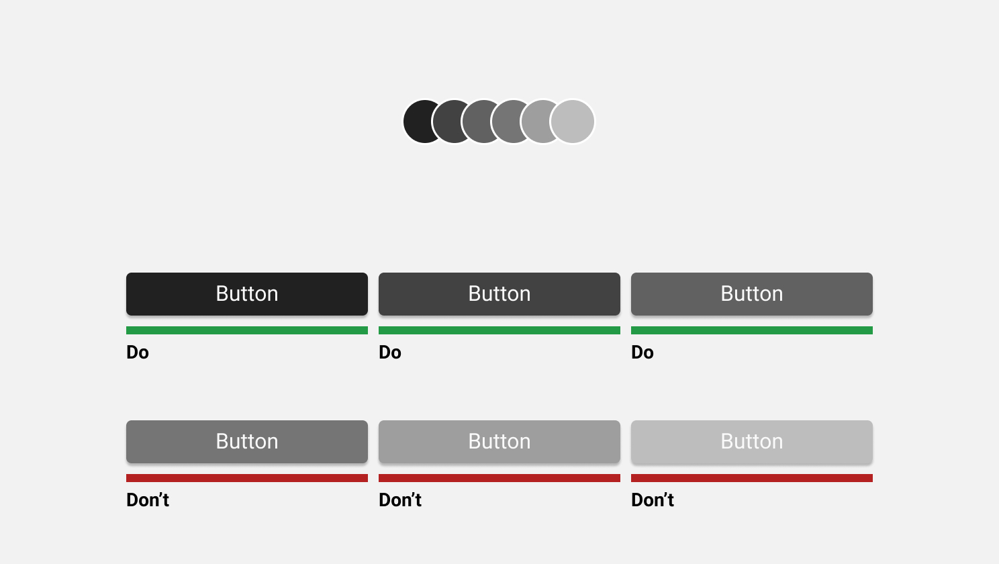
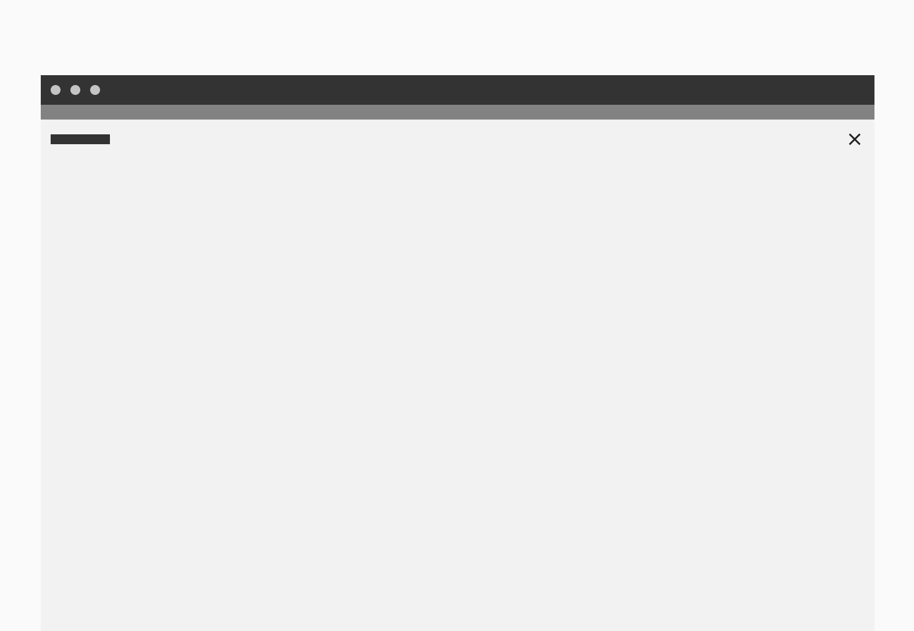

Element
==========

Element. คือส่วนที่ประกอบขึ้นเป็น User interface ผู้ใช้งานมีความคุ้นเคยกับ User interface จากประสบการณ์ที่ผ่านมาของพวกเขา โปรดเลือกใช้งานด้วยความระมัดระวัง โดยคำนึงถึงความสม่ำเสมอและสามารถคาดเดาได้ เพื่อช่วยให้เป้าหมายของผู้ใช้งานนั้นเสร็จแบบมีประสิทธิภาพและได้รับความพึงพอใจ

##### 1. Input controls
- Button, Data field, List-Box

##### 2. Selection controls
- Toggles, Radio-button, Checkbox, Dropdown list
  
##### 3. Navigational components
- Breadcrumb, Slider, Search, Pagination, Tag, Navigation Bar

##### 4. Informational components
- Tool-tip, icon, Progress bar, Notification, Message Box, Modal

##### 5. Container
- Accordion

## Input Box
#### **ชัดเจน, แตกต่างและมีประสิทธ์ภาพ**
ช่องที่ไว้สำหรับกรอกข้อมูลต้องดูแตกต่างจากข้อความปกติ ต้องเชื้อเชิญให้มีปฏิสัมพันธ์
ระยะห่างระหว่างกันต้องเพียงพอต่อการแยกแยะว่ากำลังกรอกช่องใดอยู่ 
เมื่อใดที่กรอกผิดหรือเกิดความผิดพลาดใดๆ ตัวผู้ใช้งานเองสามารถแก้ปัญหาได้ด้วยตัวเองอย่างรวดเร็ว

#### รูปร่างหน้าตาของช่องกรอก
เพื่อให้มีประสิทธิภาพรูปร่างหน้าตาควรจะดูเป็นช่องว่างและมีปฏิสัมพันธ์ได้

#### ระยะห่างระหว่างกัน
ต้องเพียงพอให้แยกได้ว่า **ป้ายชื่อ (Label)** นั้นๆเป็นของช่องกรอกใด

#### การเรียงลำดับของช่องกรอก
หากเป็นไปได้ 1 บรรทัดควรมีช่องกรอง 1 ช่อง หากมีมากกว่านั้นจะทำให้ประสิทธิภาพหายไปเนื่องจากผู้ใช้งานต้องตีความความสัมพันธ์ของแต่ละช่องกรอก
ว่าควรกรอกแนวตั้งหรือแนวนอนก่อน

ผู้ใช้งานต้องตีความว่าควรจะกรอกแนวตั้งหรือแนวนอนก่อน แล้วจะกรอกยากขึ้นอีกเมื่อมีจำนวน Row-Column เพิ่มมากขึ้น 

กรอกบน-ลงล่างทิศทางเดียว

ด้วยปริมาณข้อมูลที่มีมากเมื่อใช้งานจริง หากมีเนื่อที่จำกัด ให้จัดกลุ่มข้อมูลพร้อมที่ตั้งชื่อกลุ่มให้มีความสัมพันธ์กัน เรายังใช้ประโยชน์ของ 1 ช่องกรอกต่อ 1 แถว
เพียงแค่ตีความว่าใน 1 ช่องกรอกมีอีกหลายเรื่องย่อย

#### รูปแบบการว่างป้ายชื่อของช่องกรอก
เลือกใช้ได้ตามความเหมาะสม โดยให้คำนึงถึงประสิทธิภาพ การตีความของความสัมพันธ์ของแต่ละช่องกรอกและการใช้พื้นที่หน้าจอ

##### แบบมาตรฐาน / Standard text-field

##### แบบป้ายชื่ออยู่ระนาบเดียวกันช่องกรอก / Inline label text-field

ป้ายชื่อ - ช่องกรอกต้องอยู่ใกล้กันให้มากที่สุด หากห่างกันมากจะทำให้ประสิทธิภาพลดลง

#### โครงสร้าง

1. **ชื่อ** / Label 
2. **ไอคอนหน้า*** / Leading Icon 
3. **ข้อความช่วยเหลือ** / Helper Text 
4. **ไอคอนหลัง*** / Tailing Icon
5. **ช่องกรอก** / Text field
   
*ไม่จำเป็นต้องมี
   
#### สถานะต่างๆ

#### ช่องที่จำเป็นต้องกรอก

เมื่อใดก็ตามที่จำนวนของช่องกรอกที่ต้องระบุบมีมากกว่าช่องกรอกที่เว้นว่างได้ ให้นำ **Required indicator** ออกทั้งหมดและบอกผู้ใช้งานเพียงแค่ว่าช่องใหนให้ผู้ใช้งานข้ามได้

## Selection Control
#### ชนิดของ Selection Control

#### Label Alignment

การใช้งาน Selection Control แต่ละชนิดนั้น มีวัตถุประสงค์ในการใช้ไม่เหมือนกันดังนี้
#### เมื่อความชัดเจนและความรวดเร็วเป็นสิ่งสำคัญที่สุด

เมื่อ Requirement ต้องการใช้ผู้ใช้งาน ใช้ระบบได้อย่างรวดเร็ว การใช้งาน Checkbox, Radio และ Switch จะเป็นสิ่งที่ตอบโจทย์นี้ที่สุด เพราะการใช้ Dropdown จะเป็นการเพิ่มงานให้กับผู้ใช้งานเพราะต้องคลิ๊กเข้าไปดูว่ามีรายการอะไรให้เลือกบ้าง

ไม่ใช้ปุ่มร่วมกันกับ Switch เนื่องจากการทำงานของ Switch นั้นมีผลทันทีโดยที่ไม่ต้องกดปุ่มยืนยัน

#### เมื่ออยู่ในพื้นที่ที่มีจำกัด

เมื่อมีพื้นที่ใช้งานอย่างจำกัด และมีสิ่งที่ต้องการให้ผู้ใช้งานเลือกจำนวนมาก การใช้งาน Dropdown จะทำให้ประหยัดพื้นที่ได้มาก

#### Searchable Dropdown

กรณีที่ใน Dropdown มีตัวเลือกจำนวนมาก จะทำให้ผู้ใช้เวลาในการหาสิ่งที่เขาต้องการยากมากๆ แก้ปัญหาโดยการใช้ Searchable Dropdown 

## Button
#### **สื่อสารเข้าใจ, หาง่ายและชัดเจน**
ปุ่มเตรียมไว้ให้ผู้ใช้งานได้มีปฏิสัมพันธ์ กดเพื่อให้เกิดแอ๊คชั่นตามที่ผู้ใช้งานได้คาดหวังไว้ ตำแหน่งของปุ่มควรจะอยู่ในตำแหน่งที่ผู้ใช้งานส่วนใหญ่มองหา (มุมต่างๆโดยเฉพาะมุมขวา, ด้านส่างสุด) และชื่อของปุ่มต้องบอกใบ้หรือบอกได้ว่าอะไรจะเกิดขึ้นกับผู้ใช้งานหลังจากได้กดปุ่มนั้นๆไปแล้ว

#### ประเภทและรูปแบบ ####
ปุ่มที่ดีควรจะช่วยบอก ช่วยสื่อสารระหว่างระบบกับผู้ใช้งานว่าระบบต้องการให้ผู้ใช้งานนั้นทำอะไรเมื่อกดแล้วจะเกิดอะไรขึ้น แบ่งออกเป็นประเภทต่างๆดังนี้

**1. ปุ่มหลัก (Primary)**
**2. ปุ่มรอง (Secondary)**
**3. ปุ่มเสริม (Tertiary)**
**4. ปุ่มเบา (Ghost)**

#### 1. ปุ่มหลัก (Primary Button) ####
เมื่อผู้ใช้งานอยู่ที่หน้าจอใดๆ หากต้องการบอกให้รู้ถึงแอ็กชั่นหลัก (แอ็กชั่นที่มีผลกับผู้ใช้งานเช่นการส่งฟอร์มเอกสาร, จ่ายเงิน หรือบันทึกข้อมูลลงฐานข้อมูล) ที่สามารถทำได้ให้พิจารณาใช้ปุ่มหลัก

#### ปุ่มรอง (Secondary) ####
ในแอ๊ปพลิเคชั่นใดๆ ปุ่มหลัก/ปุ่มรอง อาจมีหน้าตาและการทำงานเหมือนกันก็ได้ แต่เมื่อได้ก็ตามที่จำเป็นต้องใช้งานทั้ง 2 ปุ่มหน้าตาทั้งปุ่มหลักและปุ่มรอง ต้องออกแบบให้ผู้ใช้งานสามารถแยกได้อย่างชัดเจน

#### ปุ่มเสริม (Tertiary) ####
เมื่อต้องการเพิ่มทางเลือกให้ผู้ใช้งานได้เลือกไปในทิศทางที่ตรงข้ามกับปุ่มหลักและปุ่มรอง

#### ปุ่มเบา (Ghost) ####
เป็นปุ่มที่ไม่มีความเกี่ยวข้องใดๆเลยกับ ปุ่มหลัก/ปุ่มรอง/ปุ่มเสริม 

## Modal
ใช้เพื่อเป็นตัวคั่นจังหวะ เพื่อให้ผู้ใช้งานได้ทำการทบทวนอีกรอบก่อนจะยืนยัน หรือเพื่อให้ข้อมูลกับผู้ใช้งาน

1.Overlay Modal

2.Full Screen Modal

#### Basic Anatomy

1. Container
2. Title
3. Supporting Text
4. Buttons

#### Priority of Modal
การใช้งาน Modal แบ่งการใช้งานตามความ Priority คือ
| Priority    | Component            | User Action         |
| ----------- | -------------------- | ------------------- |
| High        | Confirmation Modal   | กดปุ่มตัดสินใจที่จะเลือกทำ หรือ กระทำบางอย่างกับระบบเพื่อให้งานเสร็จสมบูรณ์|
| Low         | Information Modal    | กดปุ่มเพื่อรับทราบ หรือ หายไปอัตโนมัติเมื่อหมดเวลา |

## List of items
การแสดงรายการต่างๆเช่น รายการเอกสาร, รายการของผู้ใช้งาน นอกจากการแสดงผลแบบตารางแล้ว ยังสามารถแสดงรายการด้วยการ์ดได้ โดยปรับหัวตารางให้ไปอยู่คู่กับชุดข้อมูล และกลุ่มของข้อมูลที่มีความสัมพันธ์กันก็สามารถอยู่ด้วยกันโดยอาศัยหัวตาราง (label) เดียวกัน

## Card

## Loader
หลังจากผู้ใช้งานมีปฎิสัมพันธ์กับระบบ ผู้ใช้งานเริ่มรู้สึกว่าต้องรอเมื่อเวลาผ่านไปมากกว่า 1 วินาทีแล้วยังไม่ได้รับข้อมูลที่ต้องการ การใช้งาน Loader คืกการบอกผู้ใช้งานว่าเขาจะต้องรอการทำงานของระบบก่อนจึงจะสามารถทำงานต่อไปได้

#### การเลือกใช้งาน
| Component       | Waiting Time   |
| --------------- | -------------- | 
| None            | < 1 seconds    | 
| Spinner         | 1-4 seconds    | 
| Skeleton Screen | 1-4 seconds    |
| Progress Bar    | > 4 seconds    |

## Breadcrumb
ใช้เพื่อเป็น Navigation รองจาก Navigation Bar เพื่อบอกที่อยู่ปัจจุบันของผู้ใช้งานในรูปแบบลำดับชั้น หรือ ใช้เพื่อกลับไปยังหน้าจอที่ผู้ใช้จากมา

#### Appearance
1. Location based breadcrumb

ไม่ใส่ Link ที่หน้าต่างปัจจุบันที่ผู้ใช้งานกำลังใช้งานอยู่ และไม่ควรใช้ถ้าหากมีหน้าจอย่อยเพียงแค่หน้าจอเดียว

2. History based breadcrumb

#### Basic Anatomy

1. **ชื่อหน้าจอ** / Screen Label 
2. **ตัวแบ่ง** / Separator 
3. **ชื่อหน้าจอปัจจุบัน** / Current Screen Label 

#### Alignment

#### Placement

วาง Breadcrumb เอาไว้ด้านบนของหน้าจอ เพราะเป็นส่วนที่ผู้ใช้งานสามารถมองเห็นได้ชัดเจน