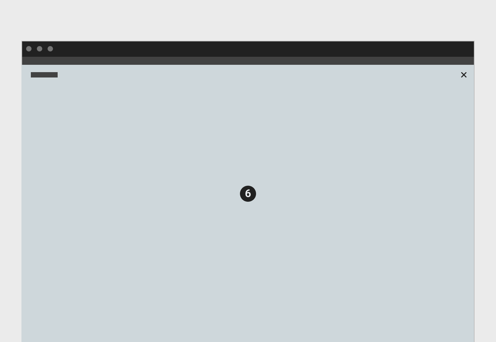
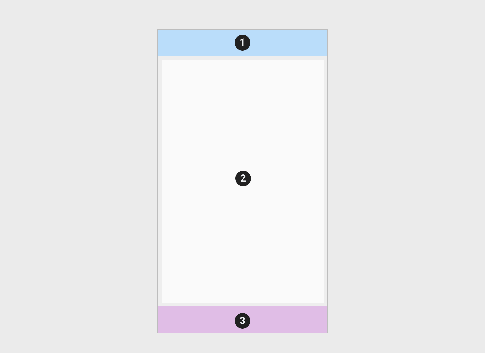
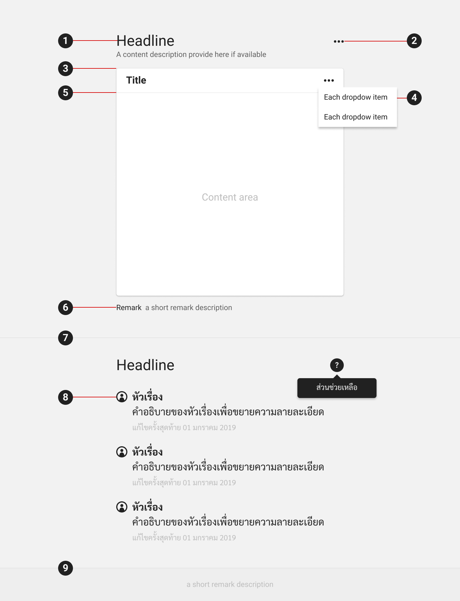

Layout
==========
#### **คาดเดาได้, สม่ำเสมอและยืดหยุ่น**
ยูสเซอร์อินเตอร์เฟสและเลย์เอ้าท์ ต้องมีความสม่ำเสมอ, อธิบายได้ด้วยตัวเองและคาดเดาได้ง่าย โดยตอบสนองต่อการทำงานของผู้ใช้งานจากการป้อนข้อมูลผ่านช่องทางต่างๆ (คีย์บอร์ด, เม้าส์, เสียง, สัมผัส) และสามารถรองรับปรับตัวจากการเปลื่ยนไปของขนาดหน้าจอตามแต่ละอุปกรณ์

##### UI Regions
เลย์เอ้าท์ประกอบไปด้วยส่วนต่างๆเช่น Application bar, Side Navigation, Content area โดยที่ UI regions ต่างๆควรจะมีความสม่ำเสมอไม่ว่าจะแสดงผลผ่านอุปกรณ์ใดๆก็ตาม 

### Application Structure
##### Desktop and Tablet

1. Global Application bar 
2. Local Navigation bar
3. Extension panel

4. Application bar accessed with dropdown
 

5. Overlay modal

6. Full screen modal

##### Mobile

1. Application bar
2. Content area
3. Main navigation

### Apperance
#### **แตกต่างน้อย, เติมเท่าที่จำเป็น**
การแบ่งเนื้อหาออกเป็นส่วนๆนั้นนอกจากทำให้เกิดความสวยงามแล้วยังช่วยให้ผู้ใช้งานเข้าถึงข้อมูลได้มีประสิทธิภาพมากขึ้นด้วย Visual ต่างๆที่ใส่เข้ามานั้นต้องใส่ด้วยความระมัดระวังเพื่อไม่ให้กวนหรือแข่งกับเนื้อหาหลักที่ผู้ใช้งานั้นกำลังสนใจอยู่

#### 1. หัวเรื่อง
หัวเรื่องไม่จำเป็นต้องอยู่ในกรอบเนื้อหาใดๆ
#### 2. ส่วนขยายของหัวเรื่อง
หัวเรื่องและส่วนขยายของหัวเรื่องนั้นไม่จำเป็นต้องอยู่บนกรอบเนื้อหาใดๆก็ได้ เนื่องจากที่ Panel ใดๆก็ตามเราต้องการให้ความสำคัญกับเนื้อหามากกว่าหัวเรื่อง 
#### 3. กรอบเนื้อหา / Container
หากต้องการจัดเนื้อหาที่มีความสัมพันธ์ออกเป็นส่วนๆและสามารถตั้งชื่อจัดกลุ่มได้อย่างชัดเจน ให้พิจารณาการใช้กรอบเนื้อหา
#### 4. Dropdown
Dropdown ดูลอยขึ้นมาจากเนื้อหาปกติเพื่อให้ผู้ใช้งานแยกออกได้ชัดเจนระหว่างเนื้อหาปกติกับเนื้อหาของ Dropdown
#### 5. เส้นคั่น / Divider
เพื่อไม่ให้เป็นการรบกวนเนื้อหาหลัก เส้นคั่นต้องดูเล็กและบาง
#### 6. หมายเหตุ
#### 7. เส้นคั่น / Divider
#### 8. รายการ
ระหว่างรายการหากมี identifier อื่นแล้วเช่นไอคอน, เลขลำดับหรือ Checkbox ก็ไม่จำเป็นต้องมีเส้นกั้นหรือต้องอยู่ในกรอบข้อความใดๆอีก

#### 9. การแบ่งส่วนเนื้อหา / Section Divider
เมื่อต้องการแบ่งเนื้อหาออกเป็นส่วนๆ แต่ไม่ต้องการให้ดูเด่นชัดไปกว่าเนื้อหาปกติ สามารถใช้เส้นคั่นพร้อมกับเปลี่ยนสีพื้นหลังเพียงเล็กน้อย
