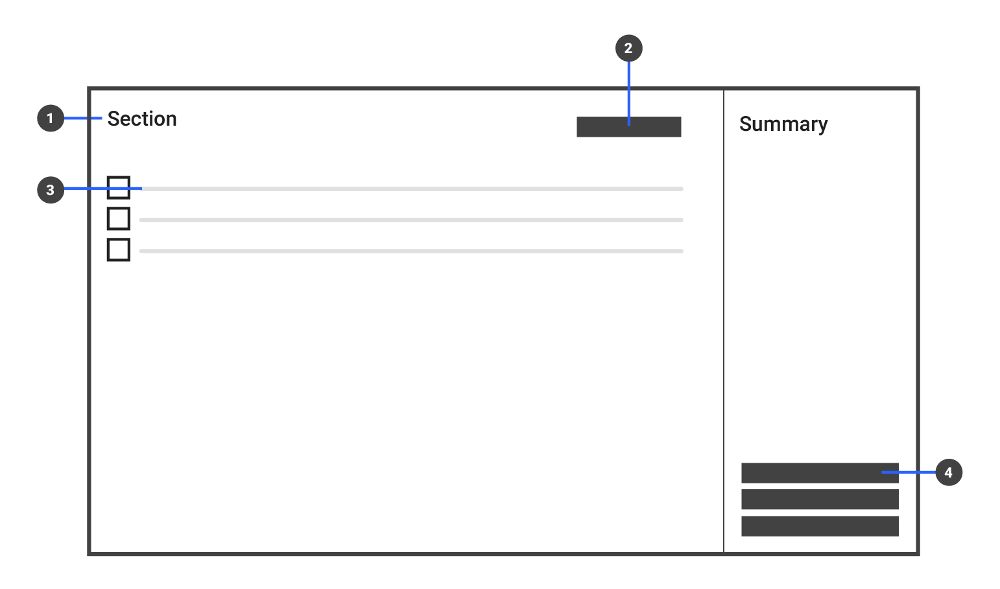

Navigation
==========

### Overview
การออกแบบ Navigation พาผู้ใช้งานไปยังหน้าต่างๆของ application เพื่อทำภารกิจของตัวเองให้สำเร็จ
เมื่อ application ตรงไปตรงมาไม่มีความซับซ้อนการออกแบบ **"หนึ่งหน้าหนึ่งรายการ"** หรือ **"หนึ่งหน้าทำงานหนึ่งอย่าง"** จึงเป็นสิ่งที่ควรทำ ตรงกันข้ามหาก application มีความซับซ้อนการทำภารกิจต้องอาศัยหลายขั้นตอนหรือมีการกระโดดจากหน้าไปอีกหน้า แนวคิดแบบหนึ่งต่อหนึ่งอาจทำให้ผู้ใช้งานทำงานยาก

ตัวอย่างต่อไปนี้มาจากโปรแกรม **PMS** ( Property management system ) โปรแกรมจัดการนิติบุคคลหน้าที่หลักคือการออกเอกสารทั้งการออกแบบหนึ่งต่อหนึ่งและการออกเอกสารจากเอกสารอ้างอิง

**1.หน้าจอหลัก** (Primary screen) ใช้แสดงรายการเอกสาร

**2.หน้าจอรอง** (Secondary screen) ใช้แสดงส่วนเพื่มเติมส่วนต่อขยายจากหน้าจอใช้งานหลัก อีกทั้งยังเป็นส่วนที่รองรับการแสดงผลแบบ Dynamic คือเมื่อ State ต่างๆของหน้าจอเปลี่ยน หน้าจอรองตรงนี้จะเปลี่ยนตามตามที่ได้กำหนดไว้

**1. Application bar** 

**2. Navigation bar** 

**3. Notification bar**  

**4. Secondary screen Call-to-action** 

### Page structure

**1. Page title** 

**2. Primary screen Call-to-action** 

**3. List of items** 

**4. Secondary screen Call-to-action** 

### Interactive design
การออกแบบส่วนที่ต้องโต้ตอบระหว่างระบบกับผู้ใช้งาน ต้องมีความสม่ำเสมอและตัวของหน้าจอเองต้องสามารถอธิบายตัวเองได้ ว่าต้องการให้ผู้ใช้งานต้องทำอะไรและอย่างไรบ้าง เพื่อให้ได้ผลลัพธ์อย่างที่ผู้ใช้งานคาดหวังไว้

**1. xxx** 

**2. xxx** 

**3. xxx** 

**4. xxx** 

เมื่อ application มีความซับซ้อนมีการขยายตัวทั้งหน้าจอหลังและรองอาจไม่เพียงพอรองรับต่อการใช้งานของผู้ใช้งาน Modal แบบเต็มจอเป็นอีกหนึ่งตัวเลือก โดยสื่อสารว่านี้คือหน้าพิเศษการใช้งานต่างออกไปจากเหตุการณ์ปกติ Modal แบบเต็มจอปิดหน้าจอหลัก-รองก็เพื่อให้ผู้ใช้งานมีสมาธิอยู่กับงานตรงหน้า ไม่ให้ข้อมูลอื่นๆที่ไม่เกี่ยวข้องมารบกวนระหว่างการใช้งาน