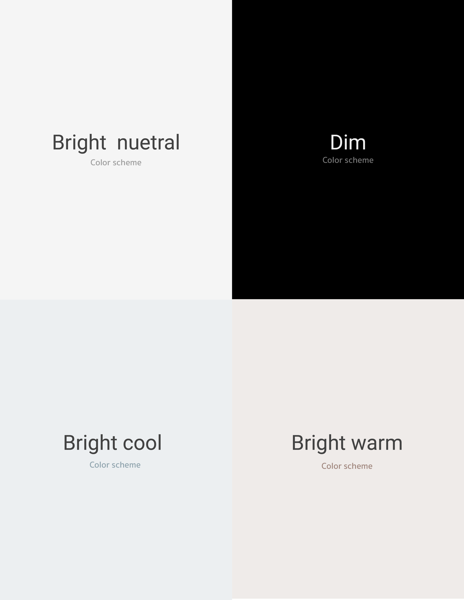
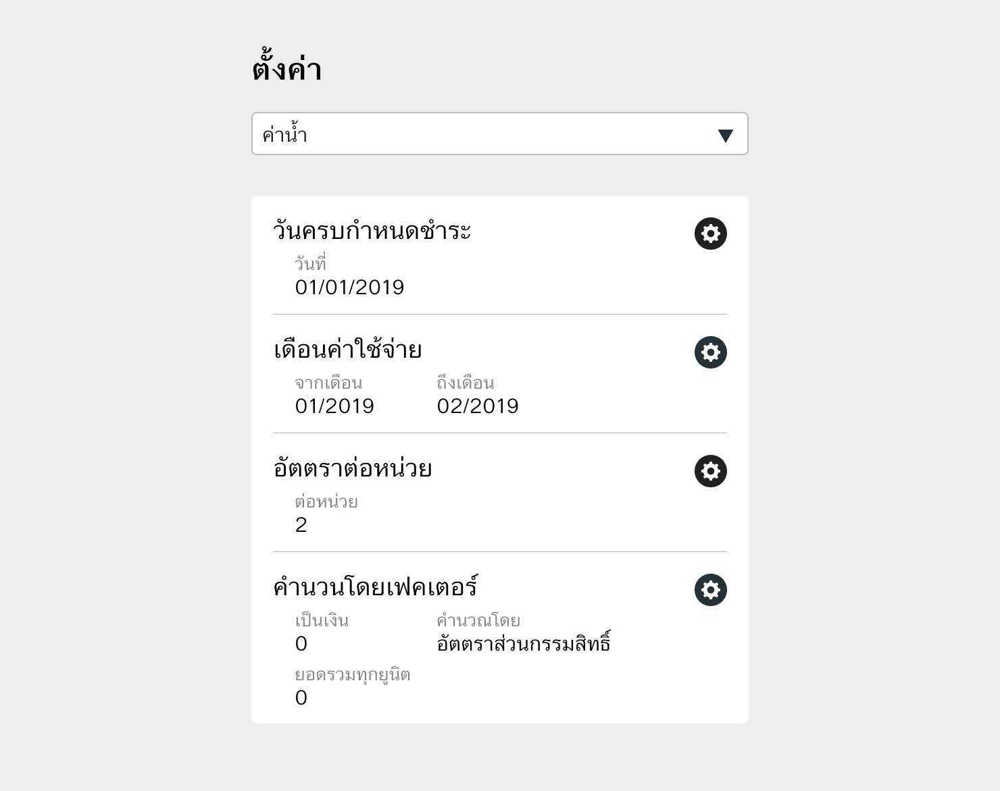
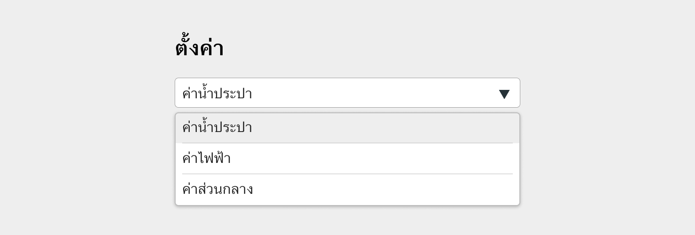

Colors
==========
สีที่นำมาใช้สร้าง User interface ไม่เพียงแค่สื่อสารด้านความสวยงานและ Branding เท่านั้น แต่ยังต้องสือสารความหมายพิเศษบางอย่างที่มีความเกี่ยวข้องกับเหตุการณ์ที่มีผลกระทบโดยตรงกับผู้ใช้งานในขณะนั้นด้วย

## Branding color

ชุดสีหลักนำไปใช้ประกอบเป็น User interface โดยนำไปใช้สร้าง UI element ต่างๆ

**1. Application background**

**2. Panel**

**3. Call-to-action button**

**4. interactive element**

## Interactive color
#### **เพียงแค่กวาดตามอง รู้ว่าตรงใหนกดได้**
การแยก interactive item ออกจากข้อมูลแสดงผลได้อย่างรวดเร็ว ช่วยเพิ่มประสิทธิภาพในการทำงานให้กับผู้ใช้งาน
นอกจากรูปร่างรูปทรงที่ดูเป็นปุ่มแล้ว สีก็เป็นอีกสิ่งหนึ่งที่สามารถแยกทั้งสองสิ่งออกจากกันได้

## Disable state
#### **ปฎิสัมพันธ์ไม่ได้ ไม่ใช่สีเทา**
บางโอกาสแอ๊ปฟลิเคชั่นต้องการปุ่มถึง 3-4 ลักษณะ (Primary / Secondary / Tertiary / Ghost ) การกำหนดให้ปุ่มที่ไม่สามารถกดได้เป็นสีเทา อาจทำให้ผู้ใช้งานแยกไม่ออกระหว่างปุ่มปกติที่ถูกกำหนดให้เป็นสีเทากับปุ่มที่กดไม่ได้

ปุ่มสีเทาเมื่ออยู่เพียงลำพัง ยากที่จะคาดเดาได้ว่าเป็นปุ่ม Active หรือ Disable

เมื่อต้องการให้ ui element ใดๆดูไม่สามารถมีปฎิสัมพันธ์ได้ให้ลด Opacity ลงเหลือ 30%

หากเมื่อสีของพื้นหลังนั้นเปลี่ยนไป เราก็ไม่จำเป็นต้องกำหนดสีของปุ่ม Disable ใหม่เพราะว่าหน้าตาของปุ่ม Disable 30% Opacity ยังคงดูเหมือนกดไม่ได้เมื่อมองผ่านๆ

## Remove all visual noise
#### **การแบ่งเนื้อหาออกเป็นส่วนๆ**
การใช้ Contrast เพียงเล็กน้อยก็สามารถแยกเนื้อหาออกจากกันได้แล้ว ให้เก็บ High contrast ไว้กับส่วนของเนื้อหาที่สำคัญหรือต้องการเรียกร้องความสนใจของผู้ใช้งาน

## System message color

ชุดสีต่อไปนี้ขอให้เก็บไว้เฉพาะแสดงข้อความที่ตอบรับจากระบบ

**1. Notification / ข้อความบอกเล่า**

**2. Danger / ข้อความอันตราย**

**3. Warning / ข้อความเตือน**

**4. Accept / ข้อความตอบรับ**

## Themes
ไม่ใช่เพียงแค่การกำหนดรูปร่างหน้าตาและสีสันของ Ui element เท่านั้น แต่รวมไปถึงสไตล์และเนื้อหาของรูปภาพ,ไอคอนและภาษาคำศัพท์ที่ช่วยเพิ่มประสิทธิภาพการสื่อสารระหว่างผู้ใช้งานกับระบบ

#### **ใช้ภาษาที่ผู้ใช้งานคุ้นเคยและเข้าใจง่าย**
คำศัพท์่ที่ใช้บนแอ็ปฟลิเคชั่นต้องเป็นคำศัพท์ที่ผู้ใช้งานเข้าใจได้ง่าย,สั้นกระชับและคุ้นเคยอยู่แล้ว รวมไปถึงข้อความต่างๆที่สื่อสารระหว่างระบบกับผู้ใช้งาน เมื่อเกิดความผิดพลาด ข้อความผิดพลาดต้องบอกสาเหตุพร้อมแนวทางวิธีการแก้ไข

#### **ดูมีชีวิตชีวา**
การไอคอนและภาพประกอบเพื่อสื่อความหมายต่างๆภายในแอ๊ปฟลิเคชั่นนอกจากช่วยเพิ่มประสิทธิภาพการสื่อสารระหว่างระบบกับผู้ใช้แล้ว ยังทำให้แอ็ปฟลิเคชั่นดูมีชีวิตชีวาและเป็นมิตรกับผู้ใช้งานมากขึ้น

#### **Application สามารถอธิบายตัวเองได้**
ช่วยอธิบายระบบให้ผู้ใช้งานได้รู้ได้อย่างรวดเร็วไม่ผิดพลาดหรือทำให้เกิดการเข้าใจผิด

#### **ต้องช่วยให้ผู้ใช้งานดูภาพรวม, แนวโน้ม, เปรียบเทียบของชุดข้อมูลได้ง่าย**
ภาพรวมของ UI Element ต้องช่วยให้ผู้ใช้งานเข้าถึงและแปลความหมายไปในทางสรุปภาพรวมได้ แนวโน้มที่เปลื่ยนแปลงไป และเปรียบเทียบระหว่างชุดข้อมูลได้มีประสิทธิภาพ

สีที่ใช้ประกอบเป็นแอฟฟลิเคชั่นสามารถเลือกใช้ได้ทั้ง 2 theme พร้อมๆกันในแอฟฟลิเคชั่นเดียวกัน ยกตัวอย่างเช่น Light theme - เมื่อล็อกอินเข้ามาเป็นผู้ใช้งาน หรือ Dark theme - เมื่อล็อกอินเข้ามาเป็นผู้ดูแลระบบ หรือใช้ทั้ง 2 theme พร้อมๆกันเมื่อต้องการให้แอฟฟลิเคชั่นมี Contrast ต่างกันมากๆในแต่ละ element เพื่อสร้าง visual hierarchy

ตัวอย่างการใช้งานเมื่อต้องการให้ element ใดๆ นั้นโดดเด่นออกมาเป็นจุดสนใจ

