Colors
==========
สีที่นำมาใช้สร้าง User interface ไม่เพียงแค่สื่อสารด้านความสวยงานและ Branding เท่านั้น แต่ยังต้องสือสารความหมายพิเศษบางอย่างที่มีความเกี่ยวข้องกับเหตุการณ์ที่มีผลกระทบโดยตรงกับผู้ใช้งานในขณะนั้นด้วย

## Branding color
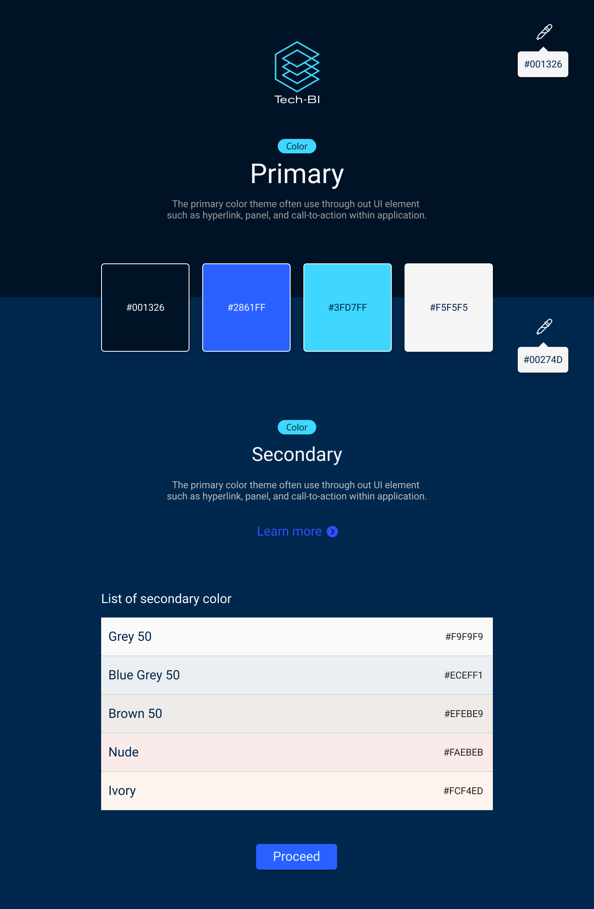

ชุดสีหลักนำไปใช้ประกอบเป็น User interface โดยนำไปใช้สร้าง UI element ต่างๆ

**1. Application background**

**2. Panel**

**3. Call-to-action button**

**4. interactive element**

## Alternative color
เมืื่อแอ๊ปฟลิเคชั่นมีความซับซ้อนมากขึ้น จำเป็นต้องใช้อื่นๆนอกเหนือจากสี branding เพื่อแยก Ui element ที่ทำงานต่างกันออกจากกัน

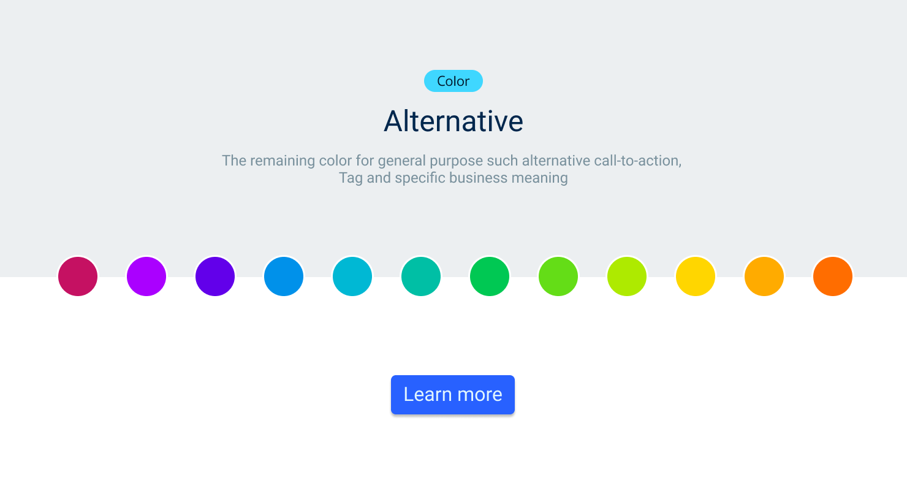
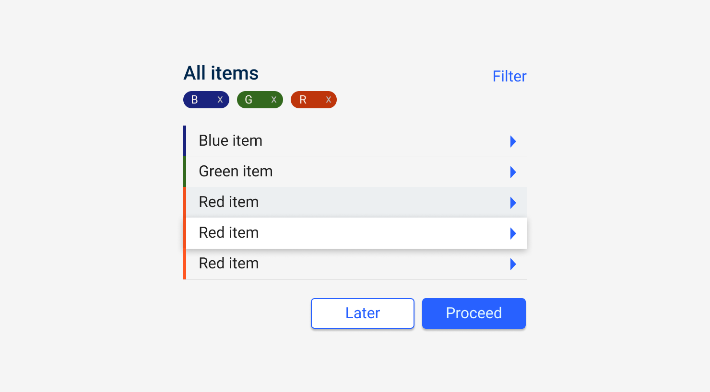

## Interactive color
#### **เพียงแค่กวาดตามอง รู้ว่าตรงใหนกดได้**
การแยก interactive item ออกจากข้อมูลแสดงผลได้อย่างรวดเร็ว ช่วยเพิ่มประสิทธิภาพในการทำงานให้กับผู้ใช้งาน
นอกจากรูปร่างรูปทรงที่ดูเป็นปุ่มแล้ว สีก็เป็นอีกสิ่งหนึ่งที่สามารถแยกทั้งสองสิ่งออกจากกันได้

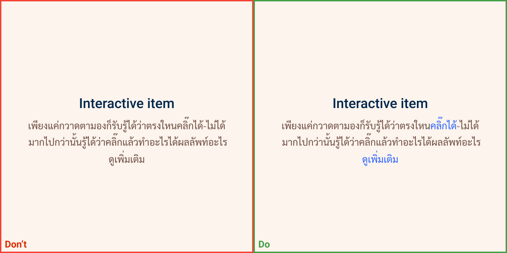

## Disable state
#### **ปฎิสัมพันธ์ไม่ได้ ไม่ใช่สีเทา**
บางโอกาสแอ๊ปฟลิเคชั่นต้องการปุ่มถึง 3-4 ลักษณะ (Primary / Secondary / Tertiary / Ghost ) การกำหนดให้ปุ่มที่ไม่สามารถกดได้เป็นสีเทา อาจทำให้ผู้ใช้งานแยกไม่ออกระหว่างปุ่มปกติที่ถูกกำหนดให้เป็นสีเทากับปุ่มที่กดไม่ได้

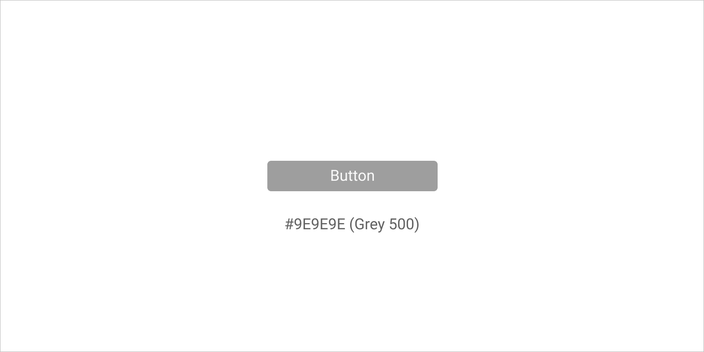

ปุ่มสีเทาเมื่ออยู่เพียงลำพัง ยากที่จะคาดเดาได้ว่าเป็นปุ่ม Active หรือ Disable

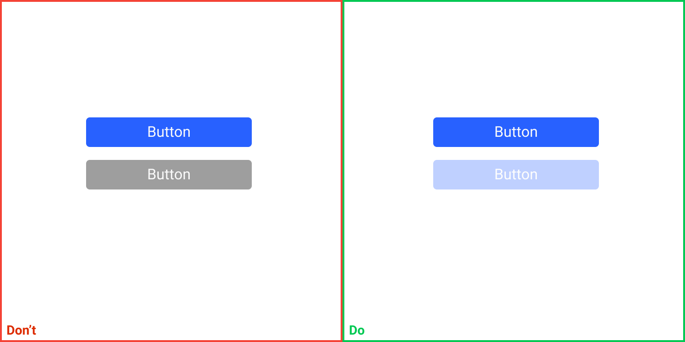

เมื่อต้องการให้ ui element ใดๆดูไม่สามารถมีปฎิสัมพันธ์ได้ให้ลด Opacity ลงเหลือ 30%

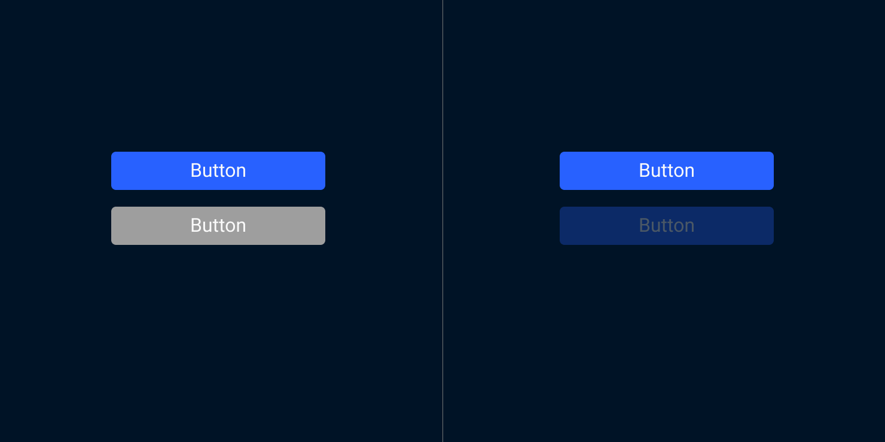

หากเมื่อสีของพื้นหลังนั้นเปลี่ยนไป เราก็ไม่จำเป็นต้องกำหนดสีของปุ่ม Disable ใหม่เพราะว่าหน้าตาของปุ่ม Disable 30% Opacity ยังคงดูเหมือนกดไม่ได้เมื่อมองผ่านๆ

## Remove all visual noise
#### **การแบ่งเนื้อหาออกเป็นส่วนๆ**
การใช้ Contrast เพียงเล็กน้อยก็สามารถแยกเนื้อหาออกจากกันได้แล้ว ให้เก็บ High contrast ไว้กับส่วนของเนื้อหาที่สำคัญหรือต้องการเรียกร้องความสนใจของผู้ใช้งาน

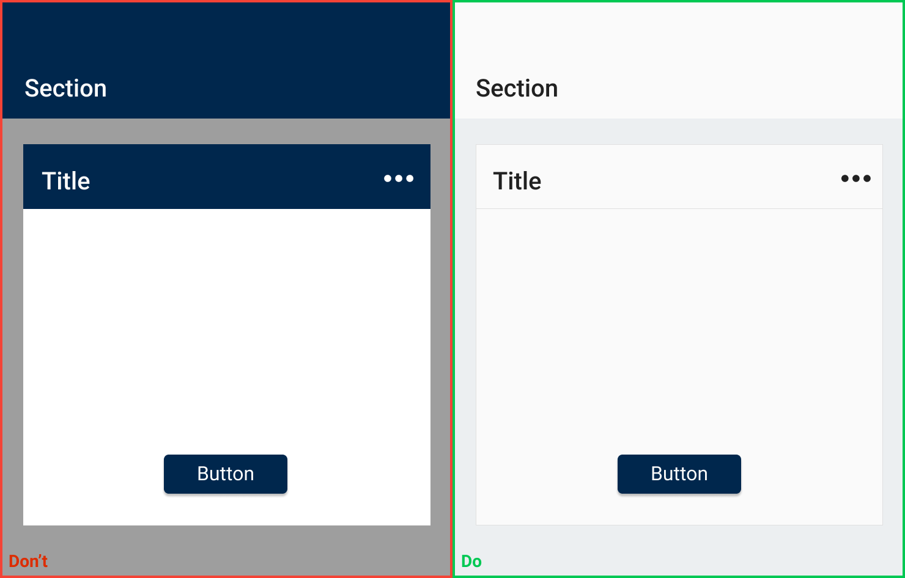

## System message color
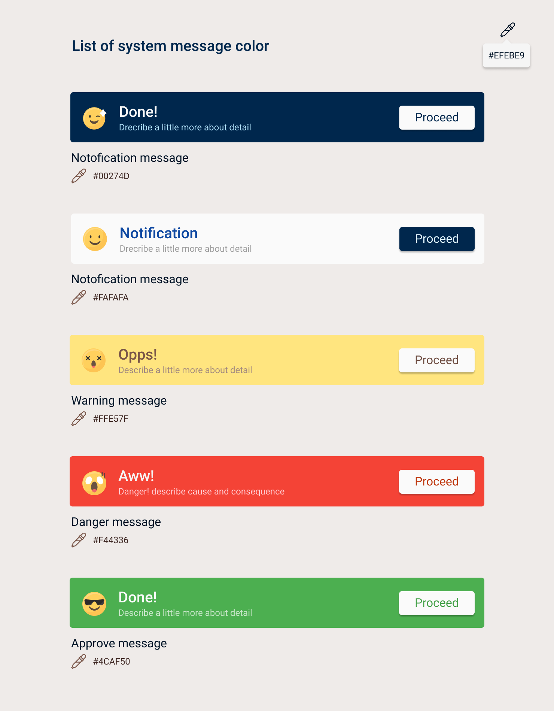

ชุดสีต่อไปนี้ขอให้เก็บไว้เฉพาะแสดงข้อความที่ตอบรับจากระบบ

**1. Notification / ข้อความบอกเล่า**

**2. Danger / ข้อความอันตราย**

**3. Warning / ข้อความเตือน**

**4. Accept / ข้อความตอบรับ**

## Language and icon
ไม่ใช่เพียงแค่การกำหนดรูปร่างหน้าตาและสีสันของ Ui element เท่านั้น แต่รวมไปถึงสไตล์และเนื้อหาของรูปภาพ,ไอคอนและภาษาคำศัพท์ที่ช่วยเพิ่มประสิทธิภาพการสื่อสารระหว่างผู้ใช้งานกับระบบ

#### **ใช้ภาษาที่ผู้ใช้งานคุ้นเคยและเข้าใจง่าย**
คำศัพท์่ที่ใช้บนแอ็ปฟลิเคชั่นต้องเป็นคำศัพท์ที่ผู้ใช้งานเข้าใจได้ง่าย,สั้นกระชับและคุ้นเคยอยู่แล้ว รวมไปถึงข้อความต่างๆที่สื่อสารระหว่างระบบกับผู้ใช้งาน เมื่อเกิดความผิดพลาด ข้อความผิดพลาดต้องบอกสาเหตุพร้อมแนวทางวิธีการแก้ไข

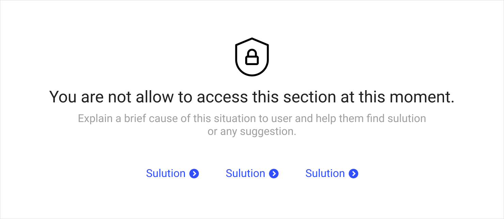
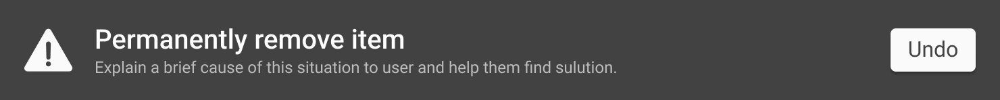

#### **ดูมีชีวิตชีวา**
การไอคอนและภาพประกอบเพื่อสื่อความหมายต่างๆภายในแอ๊ปฟลิเคชั่นนอกจากช่วยเพิ่มประสิทธิภาพการสื่อสารระหว่างระบบกับผู้ใช้แล้ว ยังทำให้แอ็ปฟลิเคชั่นดูมีชีวิตชีวาและเป็นมิตรกับผู้ใช้งานมากขึ้น

[Download icon](https://sansirimail-my.sharepoint.com/:f:/g/personal/suralertj_sansiri_com/EmSU2FCFGdBIi8s8wtIIjtIBRBRDaghXjJO1zpxdUWwVSw?e=zaU8gN)

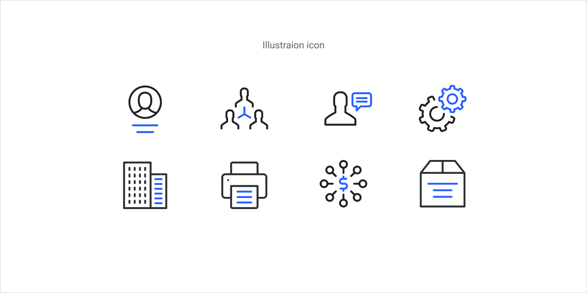

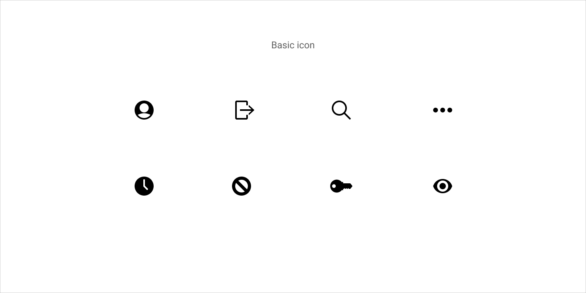

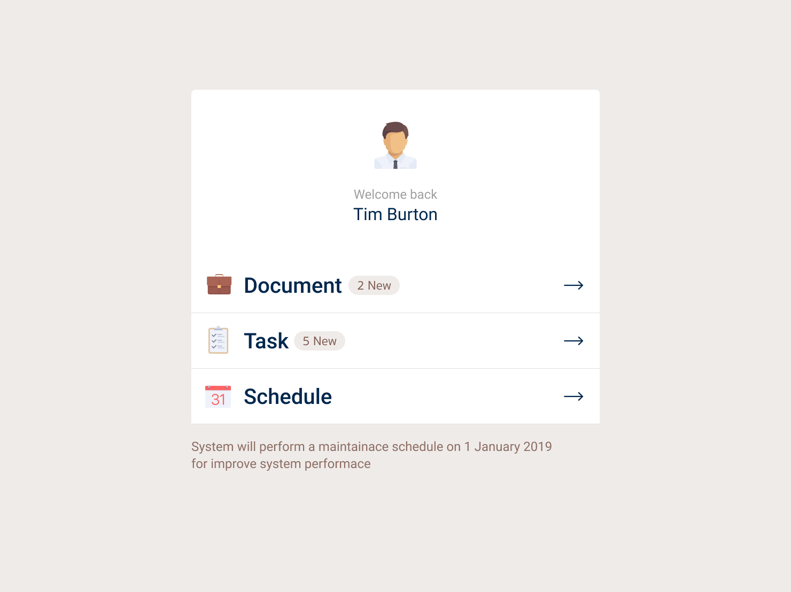

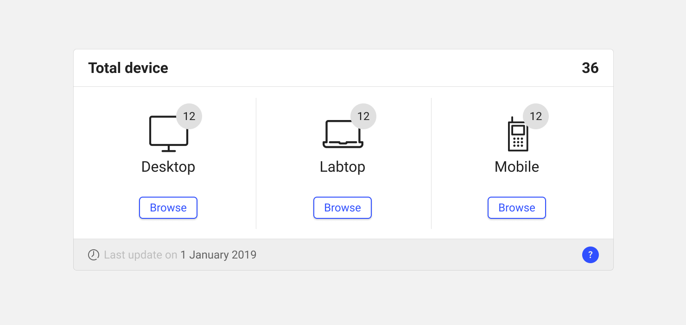

#### **Application สามารถอธิบายตัวเองได้**
ช่วยอธิบายระบบให้ผู้ใช้งานได้รู้ได้อย่างรวดเร็วไม่ผิดพลาดหรือทำให้เกิดการเข้าใจผิด

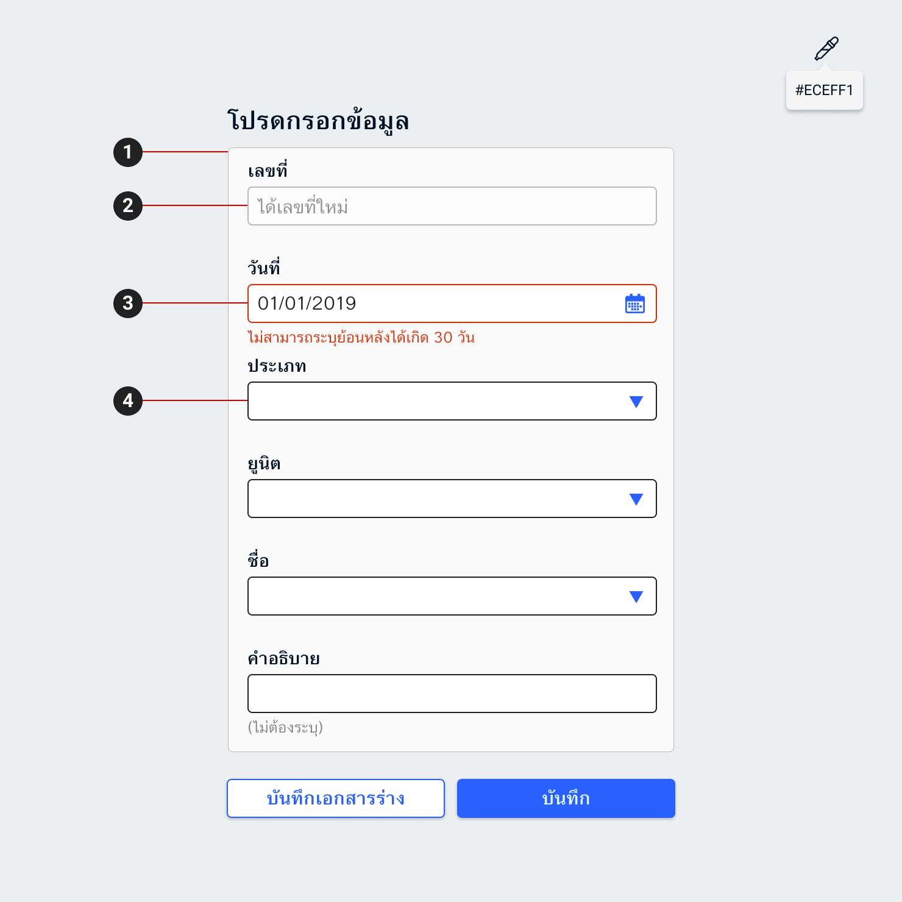

**1. Low contrast container**
ระหว่างสีพื้นหลังและสีของ Container ที่มีความแตกต่างน้อยเปิดโอกาศให้ UI Element ตัวอื่นๆโดดเด่นตามบทบาทของตัวเองตามที่ได้ถูกออกแบบไว้

**2. Disable state** ยังดูเป็นช่องกรอกแต่ไม่สามารถมีปฎิสัมพันธ์ได้

**3. Error state** เมื่อเกิดความผิดพลาด บอกชัดเจนว่าผิดผลาดตรงใหนและอย่างไร

**4. Empty UI element** ช่องกรอกที่รอให้ผู้ใช้งานกรอกควรจะดูว่างเปล่า

#### **ต้องช่วยให้ผู้ใช้งานดูภาพรวม, แนวโน้ม, เปรียบเทียบของชุดข้อมูลได้ง่าย**
ภาพรวมของ UI Element ต้องช่วยให้ผู้ใช้งานเข้าถึงและแปลความหมายไปในทางสรุปภาพรวมได้ แนวโน้มที่เปลื่ยนแปลงไป และเปรียบเทียบระหว่างชุดข้อมูลได้มีประสิทธิภาพ

## Color combination
#### **Bright theme**

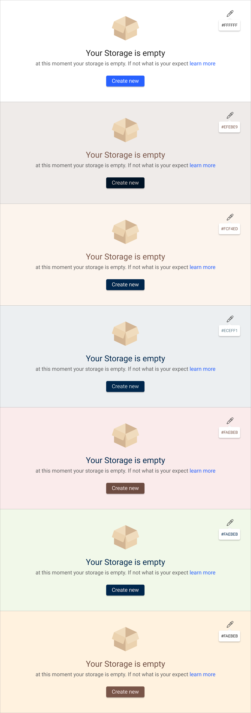

#### **Dark theme**

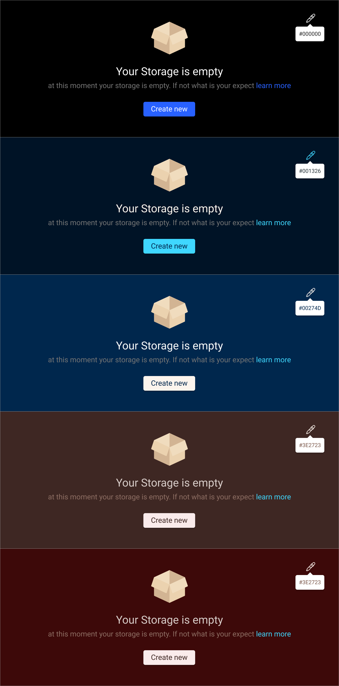

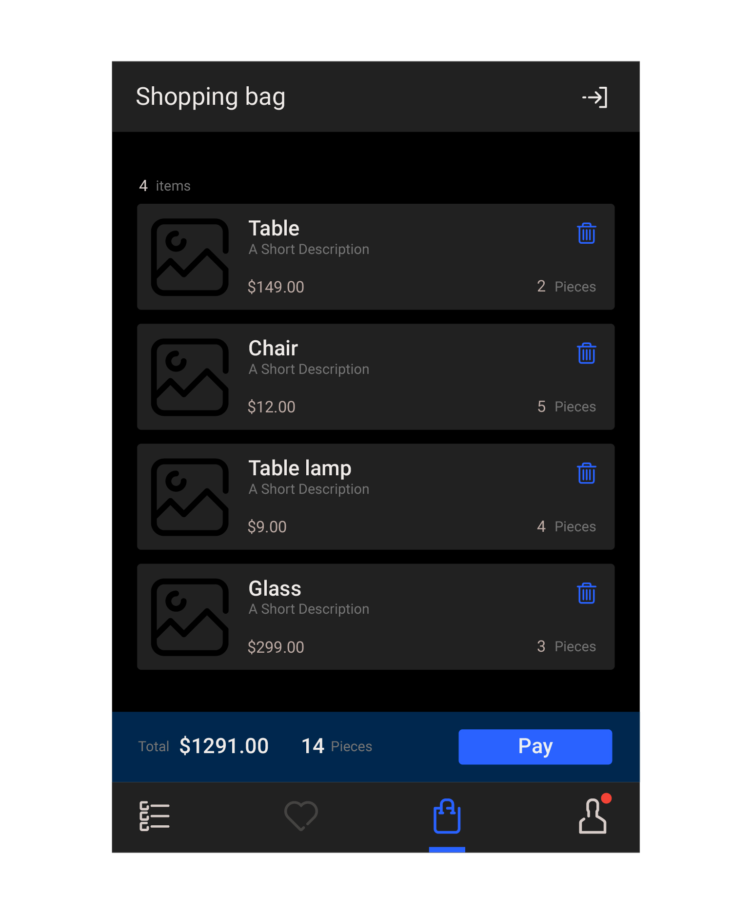
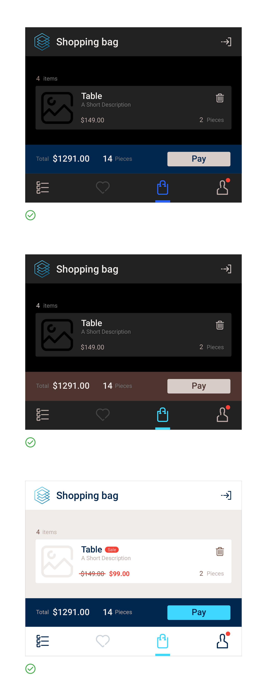

#### **Hybrid theme**

เมื่อแอ๊ปฟลิเคชั่นขยายตัวหรือมีความซับซ้อนสามารถใช้ทั้ง 2 Theme พร้อมๆกันได้เพื่อแยกเรื่องต่างๆออกจากกัน

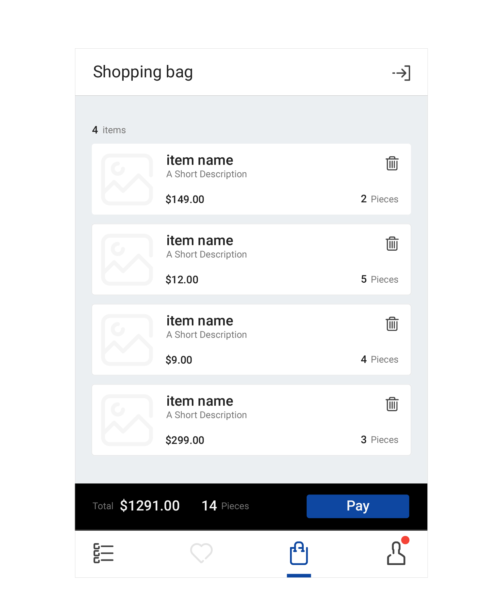
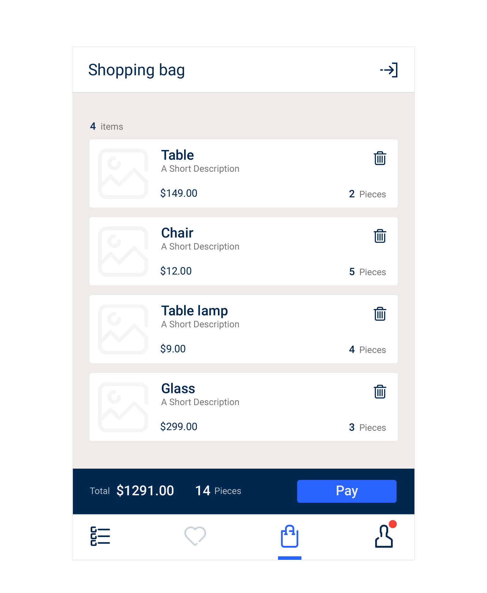

## Elevation and Focused item
การทำให้ Ui element มีหน้าตาที่ดูเหมือนนูนออกมาและยุบลงไปนอกจากความสวยงามแล้ว ยังช่วยในเรื่องการสื่อสารกับผู้ใช้งานด้วย ไม่เพียงแค่บอกว่าตรงให้คือปุ่มแต่ยังบอกได้อีกว่าปุ่มให้ถูกกดอยู่ สามารถสร้าง Visual hierarchy โดยให้เนื้อหาที่อยู่บนสุดคือเนื่อหาที่สำคัญที่สุด เนื้อหาที่อยู่ไกลออกไปคือสำคัญน้อยลง

##### **Elevation structure**
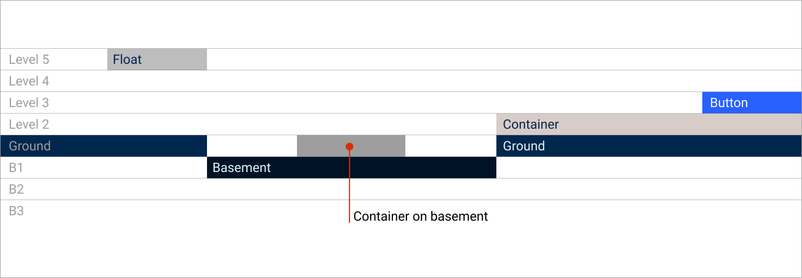

##### **Active / Enable / Disable**
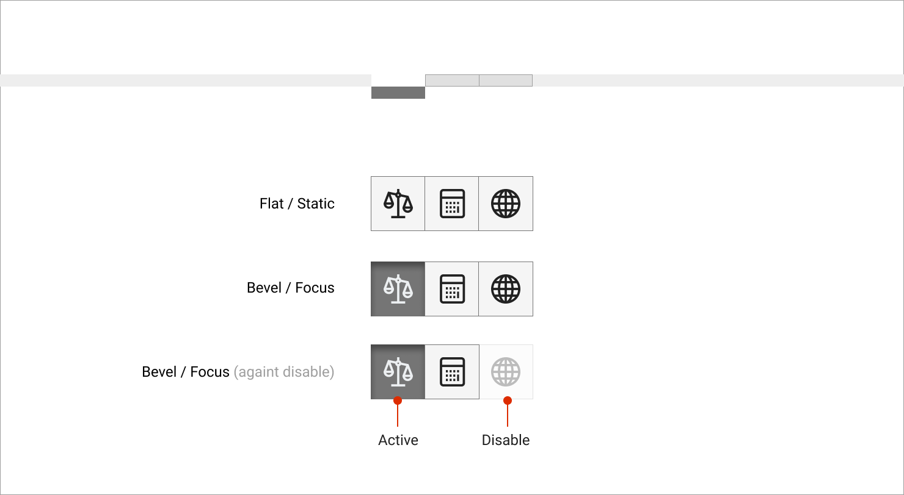

##### **Selected item**
เมื่อผู้ใช้งานละสายตาออกไปจากรายการไปสนใจเนื้อหาส่วนอื่นแล้วกลับมาดูรายการอีกครั้ง ผู้ใช้งานไม่ต้องเสียเวลามากกับการหารายการที่เลือกอยู่ เพราะรายการที่เลือกอยู่ดูต่างจากอันอื่นมาก 

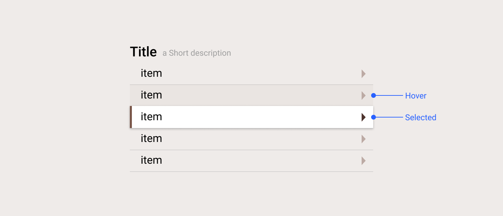