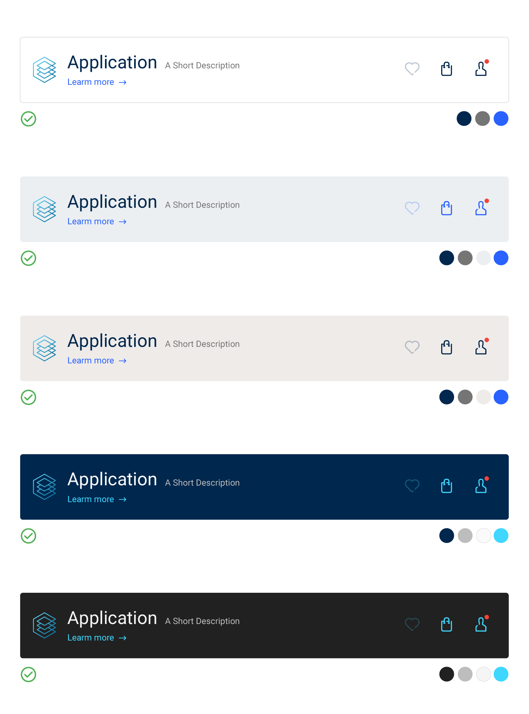
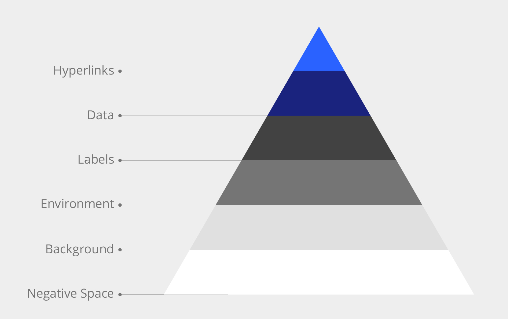
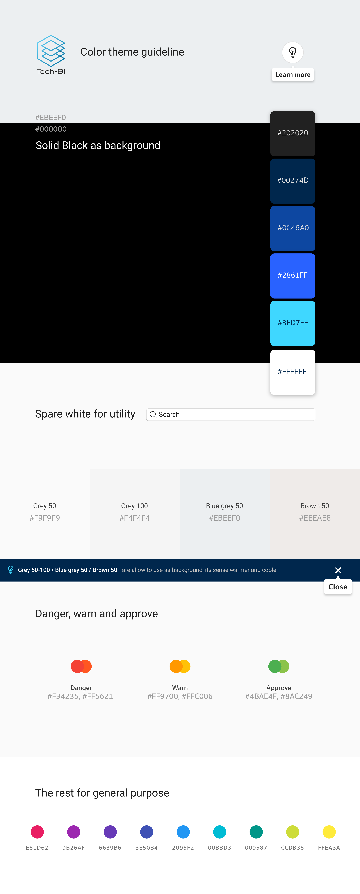

Colors
==========
สีที่นำมาใช้สร้าง User interface ไม่เพียงแค่สื่อสารด้านความสวยงานและ Branding เท่านั้น แต่ยังต้องสือสารความหมายพิเศษบางอย่างที่มีความเกี่ยวข้องกับเหตุการณ์ที่มีผลกระทบโดยตรงกับผู้ใช้งานในขณะนั้นด้วย

##### 1. Branding (Corporate) color
##### 2. User Interface color

## Branding color

##### Tech-BI Blue (Dim version)
- #001326 
- #00254D

ชุดสีที่เกี่ยวข้องกับโลโก้คือ เมื่อไรก็ตามที่ Panal ใดๆหากมีโลโก้อยู่อนุญาติให้ใช้ได้เพียง 2 สีที่กำหมดไว้เท่านั้น
สีน้ำเงินที่เหลือนั้น (Tint and shade) หากไม่มีโลโก้อยู่สามารถใช้ไปประกอบเป็น User interface element ได้

การตัดสินใจใช้สีพื้นหลังของ Ui element ต่างๆให้คำนึงถึง contrast และ legibility เป็นหลัก
ตัวอย่างด้านบนทั้งหมดสามารถใช้งานได้มี contrast ที่สูงและอ่านได้ง่าย เว้น ui element บางตัวที่มี contrast ต่ำเพื่อสือสารให้รับรู้ว่าเคยกดได้แต่ยังไม่ใช่ตอนนี้

การตัดสินใจใช้สีต่างๆเพื่อสร้าง Ui element ให้คำนึงถึง interaction เป็นอันดับแรกโดยเก็บสี Primary ไว้ให้กับ element ที่เกี่ยวข้องกับการทำ Primary task เพื่อการสื่อสารที่ชัดเจนว่าในขณะๆ แอฟลิเคชั่นต้องการให้ทำอะไร

## Themes
ไม่ใช่เพียงแค่การกำหนดรูปร่างหน้าตาและสีสันของ Ui element เท่านั้น แต่รวมไปถึงสไตล์และเนื้อหาของรูปภาพ,ไอคอนและภาษาคำศัพท์ที่ช่วยเพิ่มประสิทธิภาพการสื่อสารระหว่างผู้ใช้งานกับระบบ

#### **ใช้ภาษาที่ผู้ใช้งานคุ้นเคยและเข้าใจง่าย**
คำศัพท์่ที่ใช้บนแอ็ปฟลิเคชั่นต้องเป็นคำศัพท์ที่ผู้ใช้งานเข้าใจได้ง่าย,สั้นกระชับและคุ้นเคยอยู่แล้ว รวมไปถึงข้อความต่างๆที่สื่อสารระหว่างระบบกับผู้ใช้งาน เมื่อเกิดความผิดพลาด ข้อความผิดพลาดต้องบอกสาเหตุพร้อมแนวทางวิธีการแก้ไข

#### **ดูมีชีวิตชีวา**
การไอคอนและภาพประกอบเพื่อสื่อความหมายต่างๆภายในแอ๊ปฟลิเคชั่นนอกจากช่วยเพิ่มประสิทธิภาพการสื่อสารระหว่างระบบกับผู้ใช้แล้ว ยังทำให้แอ็ปฟลิเคชั่นดูมีชีวิตชีวาและเป็นมิตรกับผู้ใช้งานมากขึ้น

#### **Application สามารถอธิบายตัวเองได้**
ช่วยอธิบายระบบให้ผู้ใช้งานได้รู้ได้อย่างรวดเร็วไม่ผิดพลาดหรือทำให้เกิดการเข้าใจผิด

#### **ต้องช่วยให้ผู้ใช้งานดูภาพรวม, แนวโน้ม, เปรียบเทียบของชุดข้อมูลได้ง่าย**
ภาพรวมของ UI Element ต้องช่วยให้ผู้ใช้งานเข้าถึงและแปลความหมายไปในทางสรุปภาพรวมได้ แนวโน้มที่เปลื่ยนแปลงไป และเปรียบเทียบระหว่างชุดข้อมูลได้มีประสิทธิภาพ

สีที่ใช้ประกอบเป็นแอฟฟลิเคชั่นสามารถเลือกใช้ได้ทั้ง 2 theme พร้อมๆกันในแอฟฟลิเคชั่นเดียวกัน ยกตัวอย่างเช่น Light theme - เมื่อล็อกอินเข้ามาเป็นผู้ใช้งาน หรือ Dark theme - เมื่อล็อกอินเข้ามาเป็นผู้ดูแลระบบ หรือใช้ทั้ง 2 theme พร้อมๆกันเมื่อต้องการให้แอฟฟลิเคชั่นมี Contrast ต่างกันมากๆในแต่ละ element เพื่อสร้าง visual hierarchy

ตัวอย่างการใช้งานเมื่อต้องการให้ element ใดๆ นั้นโดดเด่นออกมาเป็นจุดสนใจ

