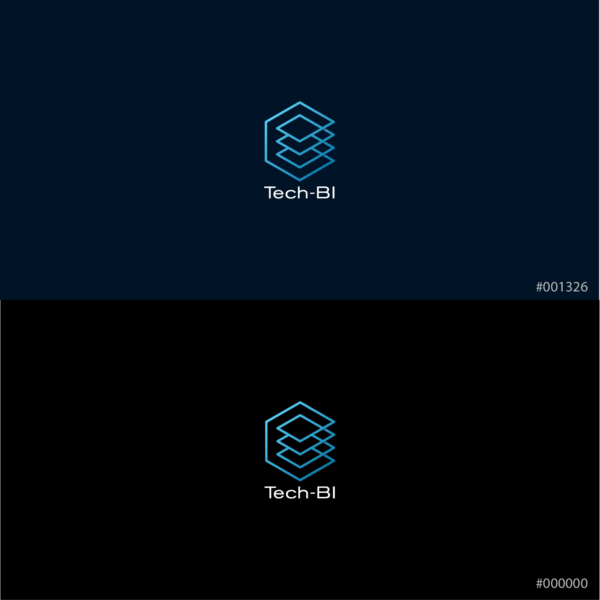
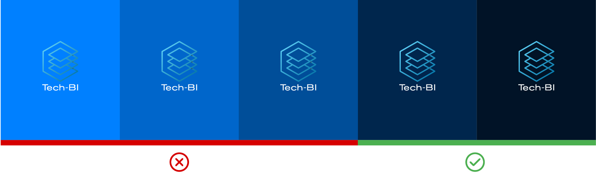
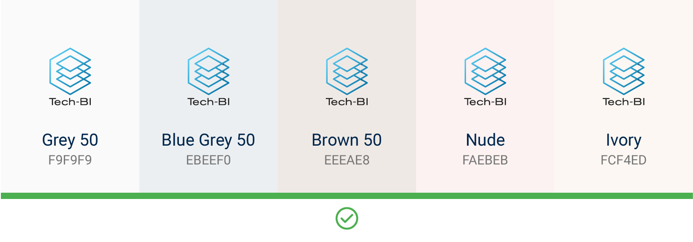

Colors
==========
สีที่นำมาใช้สร้าง User interface ไม่เพียงแค่สื่อสารด้านความสวยงานและ Branding เท่านั้น แต่ยังต้องสือสารความหมายพิเศษบางอย่างที่มีความเกี่ยวข้องกับเหตุการณ์ที่มีผลกระทบโดยตรงกับผู้ใช้งานในขณะนั้นด้วย

##### 1. Branding (Corporate) color
##### 2. User Interface color

## Branding color

##### Tech-BI Blue (Dim version)
- #001326 
- #00254D

ชุดสีที่เกี่ยวข้องกับโลโก้คือ เมื่อไรก็ตามที่ Panal ใดๆหากมีโลโก้อยู่อนุญาติให้ใช้ได้เพียง 2 สีที่กำหมดไว้เท่านั้น
สีน้ำเงินที่เหลือนั้น (Tint and shade) หากไม่มีโลโก้อยู่สามารถใช้ไปประกอบเป็น User interface element ได้

