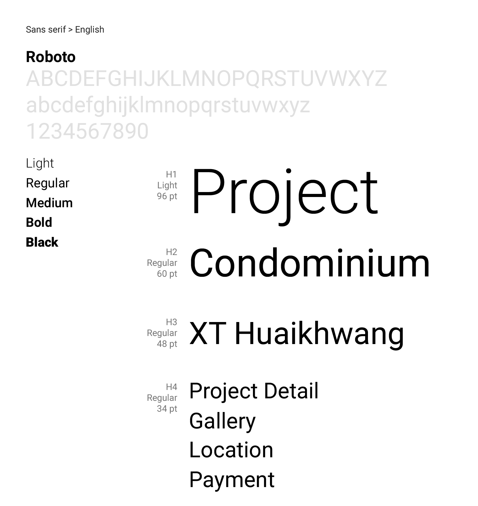
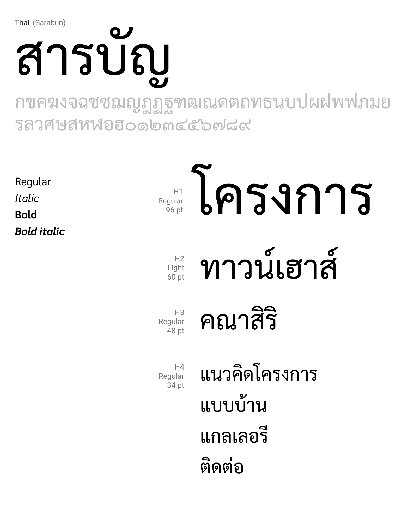

Fonts
==========

ชุดอักษรที่เลือกมาใช้ไม่เพียงแค่อ่านง่ายแต่ต้องสะท้อนถึงภาพลักษณ์ของธุรกิจนั้นๆด้วย แบ่งได้เป็น 3 ประเภท

##### 1. Serif
##### 2. San serif
##### 3. Monospace (Optional)

---

---

## Type scale

| Scale       | weight      | size        |
| ----------- | ----------- | ----------- |
| H1          | Light       | 96          |
| H2          | Light       | 60          |
| H3          | Regular     | 48          |
| H4          | Regular     | 34          |
| H5          | Regular     | 24          |
| H6          | Medium      | 20          |
| Subtitle 1  | Regular     | 16          |
| Subtitle 2  | Medium      | 14          |
| Body 1      | Regular     | 16          |
| Body 2      | Regular     | 14          |
| Caption     | Regular     | 12          |

