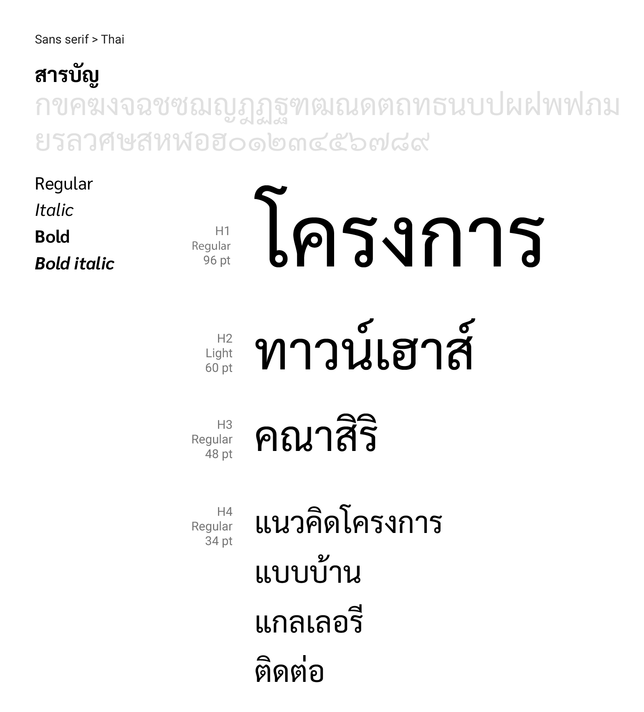

Fonts
==========

ชุดอักษรที่เลือกมาใช้ไม่เพียงแค่อ่านง่ายแต่ต้องสะท้อนถึงภาพลักษณ์ของธุรกิจนั้นๆด้วย แบ่งได้เป็น 3 ประเภท

##### 1. Serif
##### 2. San serif
##### 3. Monospace (Optional)

---

[Download Roboto](https://fonts.google.com/specimen/Roboto)

---

[Download Sarabun](https://fonts.google.com/specimen/Sarabun)

## Type scale

| Scale       | weight      | size        |
| ----------- | ----------- | ----------- |
| H1          | Light       | 96          |
| H2          | Light       | 60          |
| H3          | Regular     | 48          |
| H4          | Regular     | 34          |
| H5          | Regular     | 24          |
| H6          | Medium      | 20          |
| Subtitle 1  | Regular     | 16          |
| Subtitle 2  | Medium      | 14          |
| Body 1      | Regular     | 16          |
| Body 2      | Regular     | 14          |
| Caption     | Regular     | 12          |

## Basic title and Placement
ตัวอย่างการวางหัวเรื่อง ให้การสื่อสารระหว่าง Designer และ Developer นั้นเป็นไปในแนวทางเดียวกันและเกิดความเป็นระเบียบสวยงาม

##### 1. Sitting on baseline
ใช้เส้นฐานของชุดอักษรแตะเส้นสมมุติที่ได้กำหนดไว้

##### 2. Vertically Centered

โดยไม่สนใจเส้นฐานของตัวอักษร แต่สนใจว่าจัดกลางในแนวตั้งรึเปล่า

## Tone of voice
#### "เบาที่สุดจนเกือบกระซิบ, ดังที่สุดจนเกือบตะโกน"
ทุกๆอย่างที่ใส่ลงไปบน user interface นั้นถือเป็น visual noise ทั้งหมด ดังนั้นควรปรับขนาดให้เหมาะสมกับแต่ละสภาพแวดล้อมที่ element นั้นๆไปอาศัยอยู่

