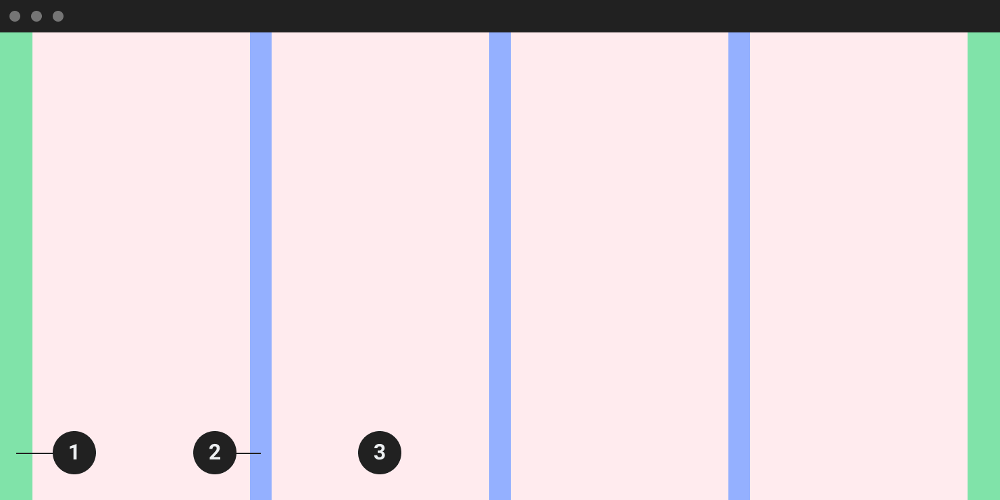
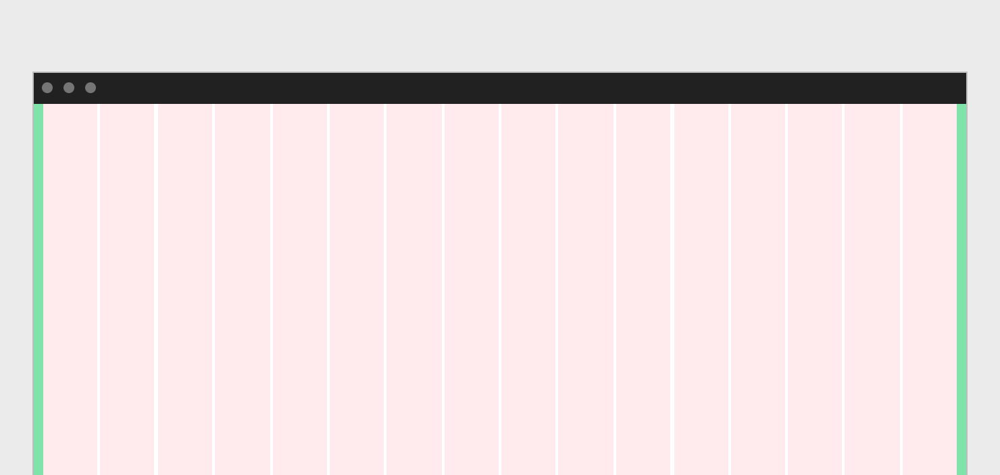
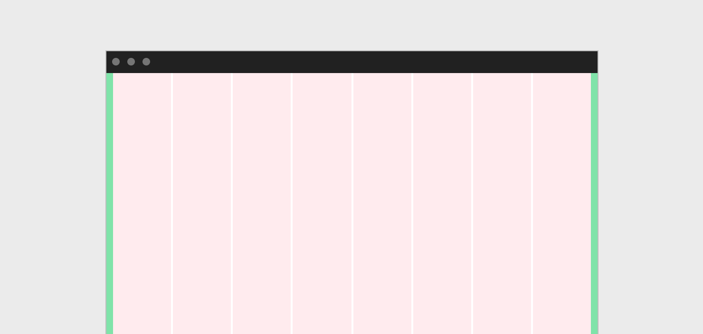
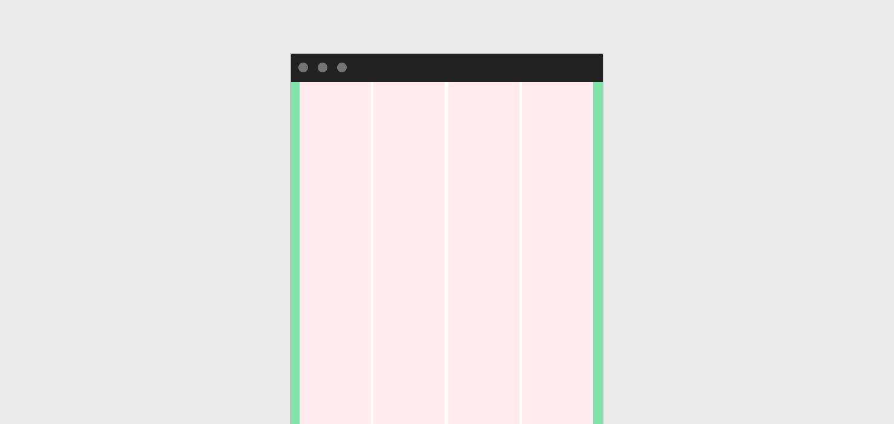

Grid
==========
เพื่อช่วยให้การออบแบบการวางคอนเทนท์ต่างๆ ลงไปบนหน้าจอเกิดความสวยงาม, เป็นระเบียบ และง่ายต่อการขยายตัวรวมไปถึงการซ่อมบำรุง (Expand and Maintainance) รวมไปถึงทำให้คอนเทนท์ นั้นมีความยืดหยุ่นรองรับกับทุกๆ ขนาดของหน้าจอที่เปลี่ยนไปตามความกว้างของอุปกรณ์ที่ใช้ในการแสดงผล

###### 1.Margin 
###### 2.Gutter 
###### 3.Column

### Column
ความกว้างของคอลัมควรกำหนดแบบยืดหยุ่นเปอร์เซ็นเทจ (Percentage) ซึ่งดีกว่าการกำหนดแบบค่าคงที่ (Fixed value) เพื่อให้คอนเทนท์ที่ไปเกาะอยู่กับคอลัมนั้นมีความยืดหยุ่นรองรับกับขนาดความกว้างของหน้าจอแสดงผลที่เปลี่ยนไป

จำนวนของคอลัมที่ใช้ขึ้นอยู่กับกับอุปกรณ์ **มือถือใช้ 4 คอลัม,** **แท็ปเลท 8 หรือ 12 คอลัม,** **จอคอมพิวเตอร์ทั้วไป 12 หรือ 16 คอลัม,**

**Desktop**

**Tablet**

**Mobile**

### Breakpoints
| Device       | Value       | Column      | Margin / Gutters |
| -----------  | ----------- | ----------- | ---------------- |
| Small        | 320         | 4           | 16               |
| Medium       | 672         | 8           | 16               |
| Large        | 1056        | 16          | 24               |
| Extra large  | 1312        | 16          | 24               |
| Max          | 1584        | 16          | 24               |

### Grid behaviors
ขนาดของหน้าจอเปลี่ยนแปลงไปตามขนาดของอุปกรณ์ หรือตามการย่อ-ขยายตามแต่ผู้ใช้งานคนนั้นๆต้องการ

1. Fluid columns
2. Fixed boxes

##### Fluid column
การแบ่งคอลัมแบบยืดหยุ่นให้ความสำคัญกับขนาดมากกว่าจำนวนของคอลัม
ที่ขนาดของหน้าจอใด (Each breakpoint) ให้กำหนดจำนวนคอลัมตามที่ต้องการในขณะที่ความกว้างของคอลัมนั้นเปลี่ยนแปลงไปตามความกว้างของหน้าจอ

##### Fixed Boxes
จำนวนของคอลัมเพิ่มหรือลดตามความกว้างของหน้าจอในขณะที่ความกว้างของแต่ละคอลัมนั้นคงที่
