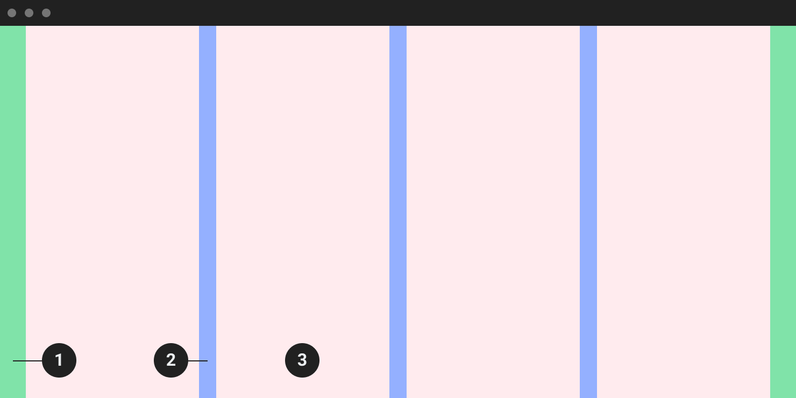

Layout
==========
เพื่อช่วยให้การออบแบบการวางคอนเทนท์ต่างๆ ลงไปบนหน้าจอเกิดความสวยงาม, เป็นระเบียบ และง่านต่อการขยายตัวรวมไปถึงการซ่อมบำรุง (Expand and Maintainance) รวมไปถึงทำให้คอนเทนท์ นั้นมีความยืดหยุ่นรองรับทุกๆขนาดของหน้าจอที่เปลี่ยนไปตามแต่ละขนาด ความกว้างของอุปกรณ์ที่ใช้ในการแสดงผล

###### 1.Margin 
###### 2.Gutter 
###### 3.Column

### Column
ความกว้างของคอลัมควรกำหนดแบบยืดหยุ่นเปอร์เซ็นเทจ (Percentage) ซึ่งดีกว่าการกำหนดแบบค่าคงที่ (Fixed value) เพื่อให้คอนเทนท์ที่ไปเกาะอยู่กับคอลัมนั้นมีความยืดหยุ่นรองรับกับหน้าจอแสดงผลที่เปลี่ยนไป

จำนวนของคอลัมที่ใช้ขึ้นอยู่กับกับอุปกรณ์ **มือถือใช้ 4 คอลัม,** **แท็ปเลท 8 หรือ 12 คอลัม,** **จอคอมพิวเตอร์ทั้วไป 12 หรือ 16 คอลัม,**