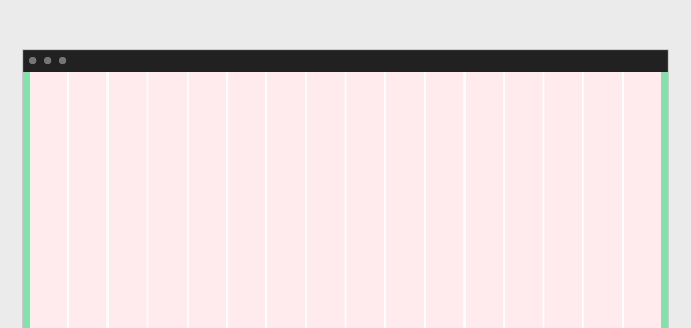
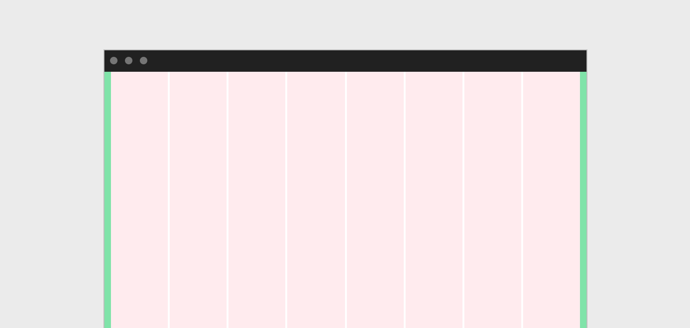
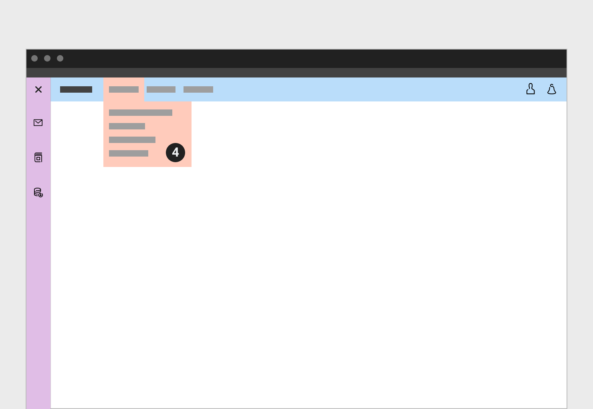

Layout
==========
เพื่อช่วยให้การออบแบบการวางคอนเทนท์ต่างๆ ลงไปบนหน้าจอเกิดความสวยงาม, เป็นระเบียบ และง่ายต่อการขยายตัวรวมไปถึงการซ่อมบำรุง (Expand and Maintainance) รวมไปถึงทำให้คอนเทนท์ นั้นมีความยืดหยุ่นรองรับกับทุกๆ ขนาดของหน้าจอที่เปลี่ยนไปตามความกว้างของอุปกรณ์ที่ใช้ในการแสดงผล

###### 1.Margin 
###### 2.Gutter 
###### 3.Column

### Column
ความกว้างของคอลัมควรกำหนดแบบยืดหยุ่นเปอร์เซ็นเทจ (Percentage) ซึ่งดีกว่าการกำหนดแบบค่าคงที่ (Fixed value) เพื่อให้คอนเทนท์ที่ไปเกาะอยู่กับคอลัมนั้นมีความยืดหยุ่นรองรับกับขนาดความกว้างของหน้าจอแสดงผลที่เปลี่ยนไป

จำนวนของคอลัมที่ใช้ขึ้นอยู่กับกับอุปกรณ์ **มือถือใช้ 4 คอลัม,** **แท็ปเลท 8 หรือ 12 คอลัม,** **จอคอมพิวเตอร์ทั้วไป 12 หรือ 16 คอลัม,**

**Desktop**

**Tablet**

**Mobile**

### Breakpoints
| Device       | Value       | Column      | Margin / Gutters |
| -----------  | ----------- | ----------- | ---------------- |
| Small        | 320         | 4           | 16               |
| Medium       | 672         | 8           | 16               |
| Large        | 1056        | 16          | 24               |
| Extra large  | 1312        | 16          | 24               |
| Max          | 1584        | 16          | 24               |

### Grid behaviors
ขนาดของหน้าจอเปลี่ยนแปลงไปตามขนาดของอุปกรณ์ หรือตามการย่อ-ขยายตามแต่ผู้ใช้งานคนนั้นๆต้องการ

1. Fluid columns
2. Fixed boxes

##### Fluid column
การแบ่งคอลัมแบบยืดหยุ่นให้ความสำคัญกับขนาดมากกว่าจำนวนของคอลัม
ที่ขนาดของหน้าจอใด (Each breakpoint) ให้กำหนดจำนวนคอลัมตามที่ต้องการในขณะที่ความกว้างของคอลัมนั้นเปลี่ยนแปลงไปตามความกว้างของหน้าจอ

##### Fixed Boxes
จำนวนของคอลัมเพิ่มหรือลดตามความกว้างของหน้าจอในขณะที่ความกว้างของแต่ละคอลัมนั้นคงที่

### Application Structure
##### Desktop and Tablet

1. Global Application bar 
2. Local Navigation bar
3. Extension panel

4. Application bar accessed with dropdown
 

5. Overlay modal

6. Full screen modal

##### Mobile

1. Application bar
2. Content area
3. Main navigation

### Apperance
#### **แตกต่างน้อย, เติ่มเท่าที่จำเป็น**
การแบ่งเนื้อหาออกเป็นส่วนๆนั้นนอกจากทำให้เกิดความสวยงามแล้วยังช่วยให้ผู้ใช้งานเข้าถึงข้อมูลได้มีประสิทธิภาพมากขึ้นด้วย Visual ต่างๆที่ใส่เข้ามานั้นต้องใส่ด้วยความระมัดระวังเพื่อไม่ให้กวนหรือแข่งกับเนื้อหาหลักที่ผู้ใช้งานั้นกำลังสนใจอยู่

#### 1. หัวเรื่อง
หัวเรื่องไม่จำเป็นต้องอยู่ในกรอบเนื้อหาใดๆ
#### 2. ส่วนขยายของหัวเรื่อง
หัวเรื่องและส่วนขยายของหัวเรื่องนั้นไม่จำเป็นต้องอยู่บนกรอบเนื้อหาใดๆก็ได้ เนื่องจากที่ Panel ใดๆก็ตามเราต้องการให้ความสำคัญกับเนื้อหามากกว่าหัวเรื่อง 
#### 3. กรอบเนื้อหา / Container
หากต้องการจัดเนื้อหาที่มีความสัมพันธ์ออกเป็นส่วนๆและสามารถตั้งชื่อจัดกลุ่มได้อย่างชัดเจน ให้พิจารณาการใช้กรอบเนื้อหา
#### 4. Dropdown
Dropdown ดูลอยขึ้นมาจากเนื้อหาปกติเพื่อให้ผู้ใช้งานแยกออกได้ชัดเจนระหว่างเนื้อหาปกติกับเนื้อหาของ Dropdown
#### 5. เส้นคั่น / Divider
เพื่อไม่ให้เป็นการรบกวนเน่ื้อหาหลัก เส้นคั่นต้องดูเล็กและบาง
#### 6. หมายเหตุ
#### 7. เส้นคั่น / Divider
#### 8. รายการ
ระหว่างรายการหากมี identifier อื่นแล้วเช่นไอคอน, เลขลำดับหรือ Checkbox ก็ไม่จำเป็นต้องมีเส้นกั้นหรือต้องอยู่ในกรอบข้อความใดๆอีก

#### 9. การแบ่งส่วนเนื้อหา / Section Divider
เมื่อต้องการแบ่งเนื้อหาออกเป็นส่วนๆ แต่ไม่ต้องการให้ดูเด่นชัดไปกว่าเนื้อหาปกติ สามารถใช้เส้นคั่นพร้อมกับเปลี่ยนสีพื้นหลังเพียงเล็กน้อย
